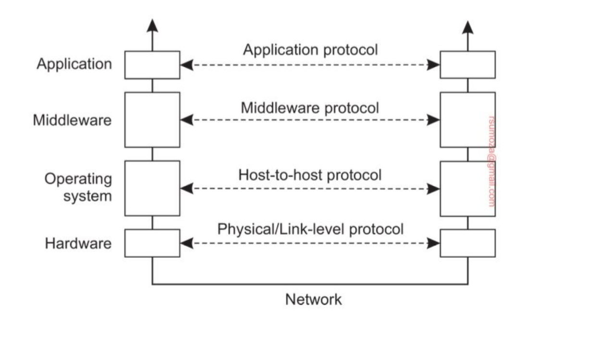
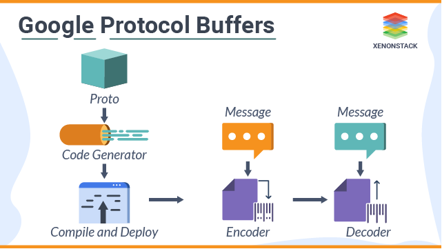

# Guía Comunicación
## Modelo OSI
### Ejercicio 1
Explicar por qué el modelo OSI es anticuado o poco representativo y por qué se opta por
hablar de middleware.
#### Respuesta
El modelo OSI no necesariamente representa un protocolo de comunicación puntual ni mucho menos un conjunto de protocolos, sino que es un modelo de referencia con demasiadas capas y con complejidad extra respecto al modelo que hace uso de Middleware, ya que para cada capa hay que implementar un protocolo de comunicación puntual que, a su vez, debe ser compatible con los de la capa superior e inferior, siendo extremadamente caro de seguir y **poco transparente**.

En cambio, se opta por TCP/IP, sobre el que se distingue la capa de **middleware**, la cual es una capa de abstracción que brinda la transparencia de la que carece OSI.



## RPC
### Ejercicio 1
En clase se presentó RPC.
¿Cómo se relacionan con los siguientes conceptos?
- HTTP
- REST
- gRPC
- GraphQL

Desarrollar un párrafo corto sobre cada uno de los temas y comparar o establecer la
relación con RPC. Considerar qué aspectos comparten y cómo se diferencian

#### Respuesta
- **HTTP**: protocolo de comunicación que opera a nivel capa de transporte, usado para transferir documentos de "hypermedia" como páginas web entre un cliente (generalmente un browser) y un servidor. El modelo de comunicación que sigue es el de REQ/REP, visto en la clase de [Comunicación](../clase_3.md)
- **gRPC**: framework open-source para implementar RPC (Remote Procedure Call) sobre cualquier aplicación. Usa HTTP por debajo, más concretamente HTTP/2. Las APIs REST usan HTTP/1.1
- **REST** (Representational State Transfer): estilo de arquitectura para web apps que sigue el modelo cliente-servidor, cuya interfaz es uniforme al hacer uso de HTTP como protocolo de comunicación (basada en métodos HTTP como GET, PUT, POST, DELETE).
- **GraphQL**: estilo de arquitectura orientado a queries hacia APIs, que también opera sobre HTTP. La diferencia principal respecto a REST es que obtiene exactamente la data que pide. 
  - Ej: si yo tengo una API que expone un endpoint que devuelve una respuesta del estilo
```json
{
    "name": string,
    "surname": string,
    "dni": number
}
```
  - En un API REST, al pegarle a ese endpoint obtendría todo el JSON.
  - En un API del estilo GraphQL, si pido:
```json
{
    name,
    surname
}
```
  - obtengo sólo eso, se ignora por completo el DNI.

Relaciones con RPC:
- **HTTP**: RPC opera generalmente sobre HTTP para hacer los llamados a procedimientos.
- **gRPC**: gRPC es un framework que permite implementar RPC sobre diversos lenguajes
- **REST**: tanto las APIs REST como RPC usan HTTP por abajo. Mientras que uno es un modelo de llamados remotos a operaciones y otro es un estilo de arquitectura, ambos se sirven de la misma herramienta para lograr su objetivo.
- **GraphQL**: la forma de operar entre ambos es parecida, en RPC el cliente decide a qué procedimiento llamar específicamente, mientras que en GraphQL el cliente decide qué datos específicos quiere traerse.

### Ejercicio 2
¿Qué es gRPC? ¿Por qué se desarrolló? ¿Por qué no se usa en aplicaciones web? ¿Por
qué si se usa en mobile? ¿Qué nos ofrece por sobre la definición de RPC vista en clase?
#### Respuesta
gRPC lo desarrolló Google porque estuvieron usando una única infraestructura de uso general llamada **Stubby** (que usa los stubs que vimos en clase) para conectar una gran cantidad de microservicios distribuidos en los data centers de Google. 

En resumen, gRPC nace a modo de evolución de Stubby, ya que este último estaba altamente acoplado a la infraestructura interna de Google como para poder ser público. Además, tenían un objetivo urgente de extenderse a casos de uso modernos, como sistemas mobile, IoT y Cloud.

Sabiendo que gRPC usa HTTP/2 por debajo, no puede usarse en web apps porque ni los browsers ni las APIs REST existentes lo soportan, dado que se basan en respuestas basadas en JSON, mientras que gRPC usa Protobuf (streams binarios multiplexados). Se puede usar **gRPC-Web** como solución intermedia, pero no alcanza, ya que tampoco es gRPC puro.

En mobile, el stack de red es decidido por quien desarrolle dicha app mobile, por lo que puede usar librerías que le den soporte sobre HTTP/2 a la aplicación en cuestión.

### Ejercicio 3
Explicar qué es Protocol Buffers y por qué se usan junto con gRPC. Comparar con JSON y
XML en términos de tamaño, eficiencia y flexibilidad.

#### Respuesta
[Protobuf](https://protobuf.dev/) (o Protocol Buffers) son mecanismos de serialización de datos flexibles y extensibles, ya que son agnósticos a la plataforma y al lenguaje. Es como un XML más chico, rápido y simple.\
Vos definís cómo estructurar los datos una vez, y después usás código específico para leer y escribir esos datos estructurados desde y hacia APIs que lo soportan. (Ver ejemplo en el link)



### Ejercicio 4
Implementar un servidor en Python y un cliente de JavaScript usando gRPC. El cliente debe
enviar una lista de personas y el servidor debe responder con el usuario de mayor edad.
```go
Person {
    string name;
    int age;
}
```

#### Respuesta
[Link al código fuente](https://github.com/FranCalveyra/distributed-systems/tree/main/src/Pr%C3%A1ctica/comunicacion/grpc)

## MPI
### Ejercicio 1
¿Cuál es la definición de mensaje en el contexto de la comunicación basada en mensajes?
#### Respuesta
No está en el libro ni en los slides, así que contesto lo que me parece:

Es la unidad mínima de comunicación de un sistema distribuido, una unidad de datos que contiene ciertos metadatos ordenados que un **emisor le envía a un cierto destinatario**. En el contexto de un sistema distribuido, tanto emisor como receptor son **procesos**, necesariamente.\
A partir de estos mensajes, los procesos pueden **ordenarse y coordinarse**.

### Ejercicio 2
¿En qué escenarios se usa MPI? Listar ejemplos reales y citar fuentes.

#### Respuesta
| Escenario                                                           | Detalles                                                                                                                                                                                                                                                                            |
| ------------------------------------------------------------------- | ----------------------------------------------------------------------------------------------------------------------------------------------------------------------------------------------------------------------------------------------------------------------------------- |
| **Modelado climático, dinámica de fluidos y ciencia de materiales** | MPI es ampliamente utilizado en simulaciones científicas complejas como predicción climática, dinámica de fluidos o estudios de comportamiento de materiales, donde se necesita comunicación eficiente entre miles de procesos en supercomputadoras. ([Number Analytics][1])        |
| **Supercomputadoras exascala (ECP, Frontier, Aurora, El Capitan)**  | En sistemas exascala patrocinados por el Departamento de Energía de EE.UU., MPI (específicamente MPICH) es la interfaz de comunicación estándar para coordinar procesos entre CPUs y GPUs en estos superordenadores. ([exascaleproject.org][2])                                     |
| **Exploración paralela de estructuras de archivos (MPI-FTW)**       | En Los Alamos National Laboratory se desarrolló una herramienta llamada MPI-FTW que explora árboles de archivos en paralelo usando MPI, dividiendo tareas entre procesos y acelerando drásticamente el recorrido comparado con versiones seriales. ([hpc.nmsu.edu][3])              |
| **Simulaciones neurológicas con MUSIC sobre MPI**                   | El framework **MUSIC** permite la comunicación entre simuladores neuronales en clusters a gran escala (como Moose, NEURON, NEST), utilizando MPI como capa de transporte para intercambiar eventos y datos en simulaciones de redes neuronales. ([Wikipedia][4])                    |
| **Visualización y renderizado científico (Tachyon)**                | Tachyon, un motor de renderizado paralelo, fue portado a MPI y usado para visualización en supercomputadoras como Blue Waters. Fue clave en la generación de imágenes científicas, como la estructura del virus HIV-1, y en proyectos relacionados con SARS-CoV-2. ([Wikipedia][5]) |
| **Entrenamiento distribuido de redes neuronales (MPI + Keras)**     | Se creó un framework en Python que combina Keras con MPI para entrenar redes neuronales distribuidas en múltiples GPUs/CPUs, usando MPI para coordinar y sincronizar el proceso de entrenamiento. ([arXiv][6])                                                                      |

[1]: https://www.numberanalytics.com/blog/mastering-mpi-in-advanced-computer-architecture?utm_source=chatgpt.com "Mastering MPI in Advanced Computer Architecture"
[2]: https://www.exascaleproject.org/research-project/exascale-mpi-mpich/?utm_source=chatgpt.com "Exascale MPI / MPICH"
[3]: https://hpc.nmsu.edu/discovery/mpi/use-case/?utm_source=chatgpt.com "MPI Use Cases - High Performance Computing"
[4]: https://en.wikipedia.org/wiki/Multi-simulation_coordinator?utm_source=chatgpt.com "Multi-simulation coordinator"
[5]: https://en.wikipedia.org/wiki/Tachyon_%28software%29?utm_source=chatgpt.com "Tachyon (software)"
[6]: https://arxiv.org/abs/1712.05878?utm_source=chatgpt.com "An MPI-Based Python Framework for Distributed Training with Keras"

### Ejercicio 3
Explicar por qué MPI no se usa de forma generalizada en aplicaciones web. Relacionar esto con: transporte, persistencia de conexiones, seguridad y compatibilidad.
#### Respuesta
De entrada, la latencia en los casos en los cuales se usa MPI es DEMASIADO BAJA, yendo al orden de magnitud de **nanosegundos**, cosa que es prácticamente imposible en las web apps que manejamos nosotros.

En cuanto al transporte, el ancho de banda que MPI requiere es altísimo, puesto que se envían volúmenes de datos mucho mayores en comparación a los que enviamos regularmente en web apps.

En lo que a persistencia de conexiones refiere, las conexiones son "efímeras" en MPI: como toda la jerarquía involucrada requiere que todos los procesos empiecen y terminen en simultáneo y bajo un mismo contexto, es imposible implementarlo en una web app, puesto que pueden haber ocasiones donde el cliente o el servidor están apagados por la razón que sea, y si implementásemos MPI serían necesario reiniciar AMBOS para poder establecer la conexión nuevamente. Además es **muy poco resiliente**, si revienta uno de los procesos asociados revienta todo.

Yendo al lado de seguridad, MPI no tiene mecanismos de seguridad integrados. Depende completamente del protocolo de comunicación que use por debajo, nada te asegura que esté usando UDP o HTTPS.

Por último, en cuanto a compatibilidad, MPI no es universal como HTTP. Es un bodrio de implementar para que sea compatible.

## ZeroMQ
Esto está explicado muy bien en la teórica, así que veo innecesario hacer los ejercicios.

## Otros tipos de comunicación
### Ejercicio 1
Lista 3 message brokers y sus características principales. ¿Es Apache Kafka un **message broker**?

#### Respuesta
- **[RabbitMQ](https://www.rabbitmq.com/)**: 
  - _Message & streaming broker_ Open Source
  - Soporta diversos protocolos de comunicación (como AMQP y MQTT). También soporta **RPC**.
  - Provee una gran flexibilidad en cuanto a las operaciones que puede realizar (ruteo, filtrado, streaming, "federation", etc.).
  - Brinda una alta confiabilidad gracias a la posibilidad de confirmar la entrega de mensajes y de replicarlos a través de un cluster. 
- **[Redis](https://redis.io/solutions/messaging/)**
  - Se maneja por el protocolo _Pub/Sub_
    - Permite mandar mensajes "ligeros", instantáneos y eficientes, óptimos para arquitecturas de baja latencia.
  - Ofrece **persistencia** para evitar la pérdida de mensajes y _Point-In-Time-Snapshots_
  - Permite **comunicación en tiempo real**
- **[Amazon SQS](https://aws.amazon.com/sqs/)**
  - _Message broker_ que se maneja como una cola de mensajería.
  - Todo aquel que quiera escuchar lo que se produjo/fue enviado por esa queue debe hacer un `POLL`.
  - Los productores y consumidores están totalmente desacoplados
  - Permite escalabilidad horizontal
  - Los mensajes pueden ser retenidos hasta 14 días
  - Los mensajes que _fallan al procesarse_ después de varios intentos son enviados a una **Dead-Letter-Queue** (DLQ) para evitar bloquear el workflow principal.
  - Soporta 2 tipos de queue:
    - **FIFO** (First In First Out), que ejecuta el `exactly-once-delivery`
    - **Estándar**, donde los mensajes se procesan en el orden en el que se mandaron y ejecuta el `at-least-once-delivery`

### Ejercicio 2
Listar tres herramientas que sirven para desarrollar o montar Enterprise Application Integration basadas en mensajes.

#### Respuesta
- Apache Kafka
- RabbitMQ
- Azure Service Bus

### Ejercicio 3
Dar un ejemplo concreto de herramientas que nos habiliten cada combinación de tipo de comunicación:
- **Sincrónica y transitoria**
- **Sincrónica y persistente**
- **Asincrónica y transitoria**
- **Asincrónica y persistente**

#### Respuesta
- **Sincrónica y transitoria**: llamadas telefónicas (?)
- **Sincrónica y persistente**: RPC + sistemas de mensajería persistentes (RabbitMQ, Apache Kafka, etc.)
- **Asincrónica y transitoria**: UDP
- **Asincrónica y persistente**: aplicaciones de mensajería (WhatsApp, Telegram, etc.)

### Ejercicio 4
Con qué tipo de comunicación diseñaría los siguientes sistemas:
- Trading financiero
- Home banking
- Whatsapp
- Uber
Explicar su decisión.

#### Respuesta
- **Trading financiero**: sincrónico y transitorio
  - Es necesario que no se reintente porque estamos hablando de un caso que involucra transacciones con dinero.
  - Justamente como tiene que ser transaccional, tengo que poder hacer todo "del tirón" para evitar problemas de consistencia en los balances de las cuentas
  - Sería sincrónico por el simple hecho de que tengo que estar esperando la respuesta de si mi transacción fue exitosa o no.
- **Home banking**: sincrónico y transitorio
  - Misma justificación que el trading
- **Whatsapp**: asincrónico y persistente
  - Lo mencionamos en puntos anteriores, pero mismo se ve en los casos de usos diarios en WhatsApp
  - Me pueden llegar mensajes en background y yo no me entero hasta que establezco una conexión lo suficientemente estable como para recibirlos
  - Mismo puedo enviar mensajes que no le terminan de llegar al destinatario/no se terminan de enviar por esas cuestiones de red, pero cuando establezca una conexión estable se procesará dicho envío
  - Es necesario para poder asegurar esa consistencia que WhatsApp ofrece
- **Uber**: asincrónico y persistente
  - Misma justificación que WhatsApp pero trasladado a poder ver la ubicación del Uber una vez reabro la aplicación
  - Por ahí no quiero estar pendiente constantemente de que el Uber se está moviendo y me quedo haciendo otra cosa con el teléfono (mandarle un mensaje a un amigo, por ejemplo).
  - La ubicación del Uber se va a seguir actualizando en background/con la aplicación cerrada, y yo me entero recién cuando vuelvo a entrar. Mi pedido no se cancela si la cierro/pongo en 2do plano.
  - Para esto es necesario que sea un esquema **asincrónico y persistente**.