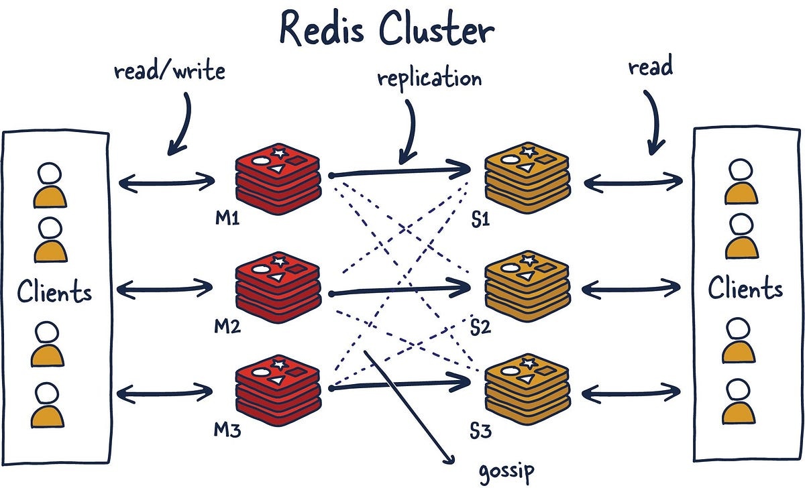

# Guía Introductoria
## Sistemas centralizados, descentralizados y distribuidos
Acá buscamos que se afiance el entendimiento de porqué es necesario y/o suficiente hacer un sistema distribuido. Para poder analizar y clasificar y entender las razones que nos mueven a hacerlo más complejo.
### Ejercicio 1
Califique y justifique los siguientes sistemas bajo estos conceptos.
- Gmail
- Spotify, Netflix
- Un server NAS (eg. synology)
- Un Home Assistant con las luces y sensores de la casa
- Una IA corriendo en un datacenter
- Un cluster de virtualización de computadoras
- Un tótem de información en el medio de un parque
Elija un sistema de su preferencia: Descríbalo, clasifíquelo y justifique

#### Respuesta:
- **NAS** (Network Attached Storage): es un sistema **centralizado** porque la decisión de a quién darle la información es de un único nodo. Es un rack de discos conectado a la red, en definitiva.
- **Home Assistant**: es un sistema **centralizado** porque quien determina el estado de las luces lo expone un sólo nodo. Independientemente de si se desincroniza o no, la responsabilidad de estar sincronizado es del server, de un _único nodo_.
- **Netflix, Spotify**: son sistemas **centralizados**, puesto que los nodos que deciden el contenido que existe en X zona, qué usuario ve qué, etc., toman las decisiones de manera central en cada zona, a pesar de que para obtener el contenido hagan una especie de "pasamanos".
- **Tótem de información**: es un sistema **centralizado**, puesto que el origen de la información es uno solo.
- **IA en Data Center**: es un sistema **centralizado**, dado que todos los servicios que consumen esa IA le hacen preguntas a esa, la cual da las respuestas de manera centralizada.
- **Cluster de virtualización de computadoras**: es un sistema **centralizado**, porque a pesar de que cada entorno virtual haga lo suyo, todos le "preguntan" cosas al sistema central/intermedio, el _HyperVisor_.
- **Gmail**: es un sistema **centralizado**, porque replica información de la infraestructura central de Google pero toma las decisiones de manera centralizada en cada instancia de "clusters" de servicios.

### Ejercicio 2
Elija un sistema de su preferencia: Descríbalo, clasifíquelo y justifique.

#### Respuesta
El [**Cluster de Redis**](https://redis.io/docs/latest/operate/oss_and_stack/reference/cluster-spec/) es una implementación _distribuida_ de Redis, cuyos objetivos son los siguientes:
- **Alto rendimiento y escalabilidad lineal** hasta 1000 nodos. No hay proxies, se utiliza replicación asíncrona y no se realizan operaciones de fusión sobre los valores.
- **Grado aceptable de seguridad en las escrituras**: el sistema intenta (en la medida de lo posible) retener todas las escrituras originadas por clientes conectados con la mayoría de los nodos maestros. Usualmente existen pequeñas ventanas en las que se pueden perder escrituras ya confirmadas. Estas ventanas son más grandes cuando los clientes están en una partición minoritaria.
- **Disponibilidad**: Redis Cluster es capaz de sobrevivir a particiones donde la mayoría de los nodos maestros son accesibles y existe al menos una réplica accesible para cada nodo maestro que ya no lo está. Además, utilizando migración de réplicas, los maestros que ya no son replicados por ninguna réplica recibirán una desde un maestro que esté cubierto por múltiples réplicas.

Funciona de esta manera:
En Redis Cluster, los nodos son responsables de almacenar los datos y de mantener el estado del clúster, incluyendo el mapeo de las claves hacia los nodos correctos. Los nodos del clúster también pueden descubrir automáticamente otros nodos, detectar nodos que no están funcionando y promover nodos réplica a maestros cuando es necesario para que el sistema siga operando ante una falla.

Para realizar estas tareas, todos los nodos del clúster están conectados mediante un bus TCP y un protocolo binario llamado Redis Cluster Bus. Cada nodo está conectado con todos los demás nodos del clúster a través de este bus. Los nodos utilizan un protocolo de gossip para propagar información sobre el clúster, descubrir nuevos nodos, enviar paquetes de ping para asegurarse de que los demás nodos estén funcionando correctamente y enviar mensajes específicos del clúster para señalar ciertas condiciones. El bus del clúster también se utiliza para propagar mensajes de Pub/Sub a través del clúster y para orquestar failovers manuales cuando son solicitados por los usuarios (los failovers manuales son aquellos que no son iniciados por el detector de fallos de Redis Cluster, sino directamente por el administrador del sistema).

Dado que los nodos del clúster no pueden hacer de proxy para las solicitudes, los clientes pueden ser redirigidos a otros nodos usando los errores de redirección **-MOVED** y **-ASK**. En teoría, el cliente es libre de enviar solicitudes a cualquier nodo del clúster y será redirigido si es necesario, por lo que no se requiere que el cliente mantenga el estado del clúster. Sin embargo, los clientes que pueden cachear el mapeo entre claves y nodos pueden mejorar el rendimiento de manera significativa.

Entonces, en cuanto a su clasificación, podemos decir que es un sistema **distribuido descentralizado**, por el hecho de que no existe un único nodo master por cluster que tome las decisiones o que tenga el control absoluto sobre el resto de nodos del cluster, si no que **las decisiones son tomadas por cualquier nodo**, teniendo todos la misma autonomía. Estas decisiones, como bien se menciona previamente, pueden ser:
- Qué nodo se tiene que apagar
- Qué nodo réplica se tiene que promover a ser un master (de acá viene la resiliencia del sistema)
- A quién le tienen que pasar qué mensaje (sabiendo que usan Pub/Sub como modelo de comunicación)
  
> Los ejercicios 3 y 4 no los voy a hacer porque es innecesario dado lo hecho en los ejercicios anteriores.

### Ejercicio 5
Dado un server plex corriendo en una raspberry donde tengo todos los videos familiares en el mismo disco, ¿cuándo pasaría a ser un sistema distribuido y por qué?

#### Respuesta
Previo a dar una respuesta, es necesario aclarar cómo funciona un Server Plex.

[Server Plex](https://www.plex.tv/personal-media-server/): es un sistema de streaming personal que te permite centralizar tu biblioteca de películas, series y música en un servidor propio. Funciona indexando tus archivos multimedia y transmitiéndolos a tus dispositivos (TV, celular, PC) vía red local o internet. Se apoya en **transcodificación** para adaptar la calidad según el dispositivo y la conexión.

Entonces, tomando la definición al principio de la [clase 2](../clase_2.md), este pasaría a ser un sistema distribuido en el momento en el que se instala, dado que requiere que todos los dispositivos que se conecten a él requieren conectarse por red para lograr el objetivo en común que es streamear películas.

## Problemas de los sistemas distribuidos
El primer paso para un buen entendimiento es conocer los problemas que pueden ocurrir
cuando dos o más computadoras se comunican entre sí

### Ejercicio 1
Busque ejemplos conocidos de problemas relacionados con cada uno de los ítems:
- Las computadoras se rompen
- No saben con quién comunicarse
- No se ponen de acuerdo
- Se corta la comunicación
- Se pierden los bits
- Pueden venir intrusos
- Obvio… hay bugs en el código

#### Respuesta
| Problema                       | Ejemplo                                                                                                                                 |
| ------------------------------ | --------------------------------------------------------------------------------------------------------------------------------------- |
| Las computadoras se rompen     | Se prende fuego el espacio físico donde corre un server                                                                                 |
| No saben con quién comunicarse | Entra un nodo nuevo a la red y no conoce a los demás, teniendo una red donde el protocolo de comunicación no permite que los "descubra" |
| No se ponen de acuerdo         | 2 nodos tienen problemas de consenso porque tenían la misma prioridad asignada                                                          |
| Se corta la comunicación       | El datacenter pierde la conectividad y queda aislado                                                                                    |
| Se pierden los bits            | Se rompe un paquete de TCP                                                                                                              |
| Pueden venir intrusos          | Hay un ataque de MiTM                                                                                                                   |
| Obvio… hay bugs en el código   | Un microservicio entra en loop infinito porque pusieron mal la condición de corte de un método recursivo                                |

### Ejercicio 2
Para cada uno de esos problemas, busque ejemplos donde se han resuelto.
- Por ejemplo: los discos hot swap, que se pueden reemplazar sin apagar el equipo
#### Respuesta
| Problema                       | Ejemplo                                                                                                              |
| ------------------------------ | -------------------------------------------------------------------------------------------------------------------- |
| Las computadoras se rompen     | Google Spanner replica datos en varios continentes, de modo que si un datacenter falla, otro sigue respondiendo.     |
| No saben con quién comunicarse | Kubernetes usa un **Service Discovery** (DNS interno + etcd) para que los pods encuentren a otros sin conocer su IP. |
| No se ponen de acuerdo         | Apache Zookeeper implementa un protocolo de consenso (Zab) para elegir un líder único y evitar conflictos.           |
| Se corta la comunicación       | Amazon S3 replica objetos en distintas Availability Zones, permitiendo acceso incluso si una zona queda aislada.     |
| Se pierden los bits            | TCP usa confirmaciones (ACK) y retransmisiones automáticas para asegurar que los datos lleguen completos.            |
| Pueden venir intrusos          | HTTPS/TLS cifra las comunicaciones, evitando ataques de man-in-the-middle en servicios como Gmail o Netflix.         |
| Obvio… hay bugs en el código   | Netflix Chaos Monkey detecta fallos inyectados y prueba la resiliencia de los servicios para mejorar el software.    |
