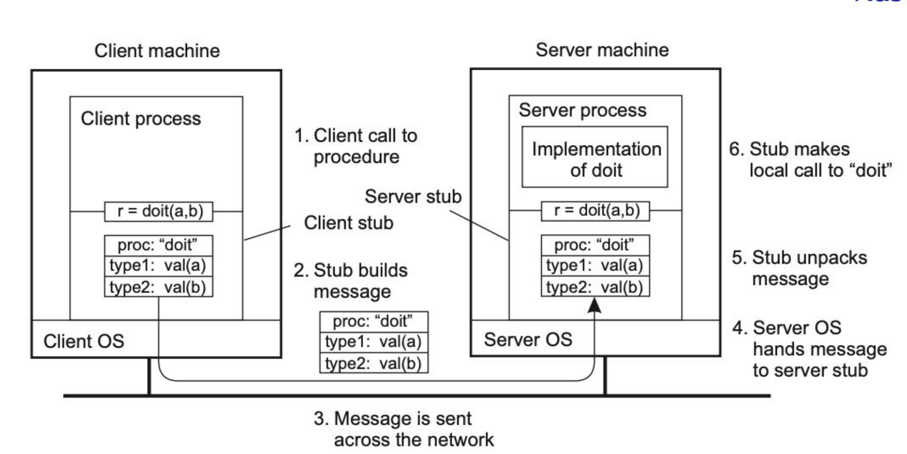
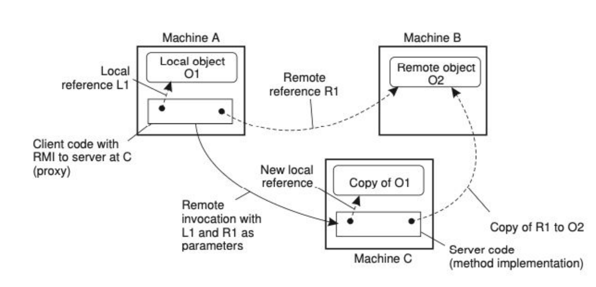
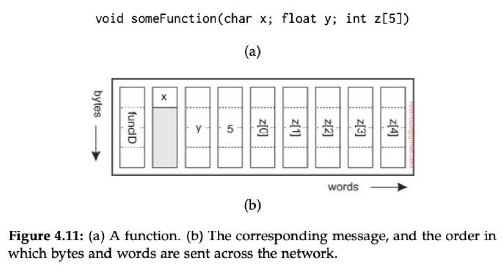
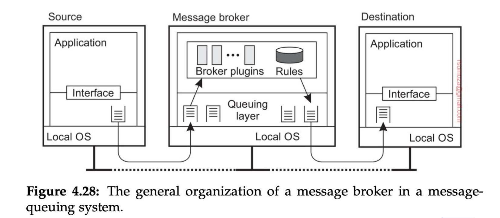
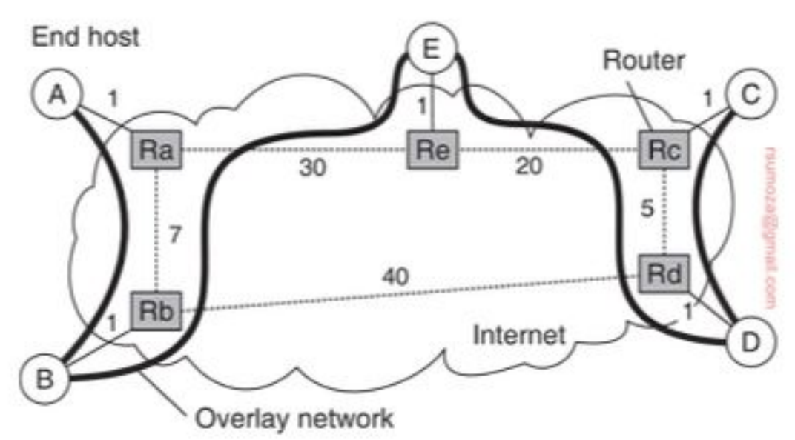

# Aclaraciones respecto de la clase pasada
Un servidor en Brasil suele ser más caro que en EE.UU, puesto que en USA abundan mucho más los servidores, además de que la energía es potencialmente más barata.

Es muy raro que existan servidores en América del Sur.

Si montamos un servicio en servers de Amazon en USA, va a andar bien a pesar de la lejanía. ¿Por qué? => **Hay cables directos** que conectan Argentina con USA-East.

**CAP**
- **Consistencia**: si yo escribo A en un lugar, y lo leo desde otro lado, tengo que leer A, sin modificaciones.
- **Disponibilidad**: está estrictamente relacionada con la consistencia, puesto que quiero respuestas rápidas.
  - En el caso de las bases no relacionales, empieza a haber un trade-off entre la C y la D. A veces puedo llegar a querer responder rápido en lugar de responder con lo último.
  - Volviendo al caso de la clase pasada (caso símil Netflix), con las recomendaciones voy a tener un problema (hasta cierto punto), puesto que no siempre quiero lo último.
  - En cambio, para casos como los pagos, voy a necesitar darle prioridad a la consistencia. No puedo darle un servicio al usuario hasta que sepa que pagó.
- **Particionamiento**: con algún criterio, elijo cómo distribuyo los valores que persisto en mis distintas instancias.
  - **Problema**: se cae una instancia, pierdo disponibilidad
  - **Solución**: replicar las instancias con un cierto criterio.
    - Ej: tener 2 réplicas para cada instancia.

# Comunicación
Para comunicar 2 procesos, es necesaria alguna interfaz que medie entre estos. Por lo general, usamos algún protocolo de comunicación (ej: HTTP).

**¿Para qué lo estudiamos?**
- Porque es el método por el que los procesos distribuidos comparten información, lo que lo vuelve una pieza indispensable para hacerlos funcionar, y de forma eficiente.
- Porque el **tipo de comunicación** está fuertemente relacionado a requerimientos funcionales y no funcionales. Son **decisiones de arquitectura**

## Modelo OSI
- El modelo OSI es un marco conceptual que divide la comunicación de redes en 7 capas organizadas de forma jerárquica.
- Sirve para estandarizar cómo los sistemas se comunican entre sí a través del uso de protocolos
- Cada capa se encarga de proveer **servicios** específicos a la capa superior.
- Del lado del emisor cada capa suma su header con su metadata al mensaje original. La versión final es enviada a través de la capa física 
- Del lado del receptor cada capa procesa la parte del header correspondiente, la quita del mensaje y envía el resto a la parte superior 
- Es importante notar que el modelo OSI es un modelo de referencia y no un conjunto de protocolos concretos
Decimos que es un modelo porque es una representación de cómo funciona y cómo se envía la información a través de los distintos protocolos de comunicación.

### Problema del Modelo OSI
TCP/IP le rompió el orto, para simplificar, porque era mucho más simple de implementar y modelar que OSI. 

OSI, por su parte, yacía con el problema de que, para cada capa, había que implementar un protocolo puntual, lo cual le agregaba complejidad, ya que debía "funcionar" con el resto de protocolos (el de la capa de arriba, el de la de abajo, y consigo mismo).

### TCP/IP ganó la guerra
Para que sean prácticos (tanto OSI como TCP/IP), hay que prestar mucha atención a cada capa.

No solemos interactuar mucho con las capas debajo de la de aplicación.

## Capa de Middleware
Tanenbaum y otros autores terminan diferenciando la capa de middleware: procesos que corresponden a la capa de aplicación pero proveen servicios generales a otros procesos
- DNS le permite a las aplicaciones encontrar direcciones de red asociados a nombres (domains)
- Autenticación y autorización, que permiten identificar y permitir o denegar acceso
- Mismo lo hacemos a **nivel capa de aplicación** casi siempre, cuando implementamos o usamos (ej: [Auth0](https://auth0.com/)) **Authentication Middlewares**, que validan si un usuario está autenticado y/o autorizado para realizar cierta acción.

Todo lo que hace el middleware es proveer capas de abstracción.

## Tipos de comunicación
- **Sincrónica**: envío un mensaje y espero la respuesta, quedándome bloqueado hasta que llegue.
  - Ej: una conversación cara a cara, una llamada.
- **Asincrónica**: emito el mensaje y trabajo con otra cosa; la respuesta me va a llegar cuando me tenga que llegar.
  - Ej: una conversación por WhatsApp.
- **Transitoria**: si el receptor o alguna parte del sistema de transmisión falla, el mensaje se pierde
- **Persistente**: el middleware va a garantizar que el mensaje llegue al receptor, aunque no esté activo en ese momento.

Vamos a empezar a usar combinaciones de estos tipos de comunicación
## RPC
Refiere a **Remote Procedure Call**.

Anteriormente, las aplicaciones se programaban al punto de codear manualmente la forma de mandar mensajes. Es decir, leyendo el código, sabía perfectamente en qué momento se manda el mensaje, lo cual **no** era transparente.

Al presentar RPC, se planteó que la comunicación tiene que ser tan simple como llamar a un procedimiento de forma local, más allá de que se está ejecutando en otra máquina. La comunicación es totalmente transparente para el programador.

`RPC` es un **modelo de comunicación** que permite a un programa ejecutar procedimientos en otra máquina como si fuesen locales, cuya idea es esconder la complejidad de la red: yo llamo a la función `sumar(2,3)` desde mi notebook, y en lugar de correrlo localmente lo estoy corriendo en una Raspberry PI que tengo a 40 metros.

> Procedimiento $ \ne $ Función. Un procedimiento no devuelve un valor, es similar a una _void function_. Por eso RPC usa **procedimientos**.

**Stub**: código que, en principio, no cumple el problema que estamos resolviendo, pero tiene herramientas que te brindan formas de hacerlo. Se encarga de transformar parámetros pasados entre el cliente y el servidor durante un RPC.

El cliente y el servidor conocen un stub en particular, que sirven como una interfaz que los abstraen de la forma de comunicación.

En resumidas cuentas, es un "middleware" que funciona como capa de abstracción entre cliente y servidor para que el cliente pueda ejecutar un RPC sobre el servidor.



### Parámetros
- Manejar parámetros en RPC no es trivial: codificar y decodificar los parámetros se llama **marshalling** (GO MENTIONED 🗣️🗣️) y **unmarshalling**.
- La idea es poder transformar información a formatos neutrales (bytes) que tanto el cliente como el server pueden interpretar de manera automática.
- Los problemas surgen cuando tratamos con punteros o colecciones: deberíamos enviar toda la colección o el objeto al que hace referencia el puntero al servidor. No es imposible pero tenemos que tener en cuenta que es costoso.
- Cuando tratamos con objetos muy complejos o colecciones anidadas el marshalling automático podría no estar disponible. Sería preferible manejarlo de manera manual.
- Estos problemas se alivian usando **referencias globales**.

¿Por qué no usamos JSON para sincronizar 2 stubs en RPC? => Porque es súper ineficiente, si mando el JSON lo mando entero, no se comprime. Si bien existe RPC para JSON, es una cagada.

### Referencias globales
Es una referencia que todos los miembros del sistema/programa conocen.
En un sistema distribuido, que todos los servicios conozcan una referencia particular, se logra teniendo servicios/máquinas que estén dedicadas al pasaje de esa información o de esas referencias. Claramente, esto se hace cuando tenemos objetos relativamente pesados, si paso un int o un boolean por referencias globales usando RPC, soy un forro.


- Lo que se ve en la foto es lo siguiente: 
  - Machine `A` – Objeto local `O1`
    - En la máquina `A` existe un objeto local `O1`.
    - El cliente en `A` tiene una referencia local (`L1`) para acceder a él directamente.
  - Machine `B` – Objeto remoto `O2`
    - En la máquina `B` existe un objeto remoto `O2`.
    - Machine `A` tiene una referencia remota (`R1`) para invocar métodos sobre `O2`.
    - Esa referencia `R1` es en realidad un proxy/stub que traduce las invocaciones locales en llamadas remotas a `B`.
  - Machine `C` – Ejecución de un método remoto
    - El cliente en `A` invoca un método remoto en Machine `C`, pasando como parámetros tanto `L1` (referencia a O1) como `R1` (referencia a `O2`).
    - Machine `C` recibe esas referencias, y aquí ocurre lo importante:
      - Para `L1`: en vez de pasar el objeto completo, se crea una copia de `O1` en Machine `C` con una nueva referencia local.
      - Para `R1`: en Machine `C` se crea una copia de la referencia remota a `O2`, de manera que desde `C` se puede seguir invocando métodos sobre el objeto en `B`.
- En un sistema basado en objetos usar referencias es ideal
- Esto deja de ser eficiente cuando los objetos a los que hacemos referencia son pequeños (`ints`, `booleans`)

### Soporte
Si usamos RPC, el cliente y el servidor tienen que estar de acuerdo en el protocolo (formato de mensajes + procedimiento para manejar estructuras complejas). Para lograr eso, se puede **especificar la interfaz y generar automáticamente los stubs**. Otra alternativa es **hacerlo parte del lenguaje**.



Las diferentes herramientas de RPC lo hacen de manera automática.

### ¿Cómo armamos un sistema que use RPC?
Tenemos escenarios donde RPC es parte del lenguaje, lo cual sirve cuando los servicios están hechos con el mismo lenguaje. Un ejemplo en Java es RMI.

RPC es parte de la guía, lo vamos a tener que ver por nuestra cuenta.

Gran parte de los conocimientos los vamos a incorporar mejor de manera práctica.

## Comunicación basada en mensajes
Los mensajes son finitos, en algún momento terminan, tienen un sentido (por esto un `TcpStream` de Rust no es un mensaje como tal, sino una cadena infinita de mensajes). En general tienen una interfaz que conocemos.

Los mensajes empiezan a ser relevantes en comunicación **asíncrona**, donde empiezan a surgir ciertas preguntas:
- ¿Qué pasa cuando el **receptor no está activo** en el momento en el que se genera la request?
- ¿Qué pasa cuando **no queremos o necesitamos que la comunicación sea sincrónica**?
- Excepto por algunas variaciones poco comunes, RPC no soporta estos casos. Y por eso necesitamos usar **mensajes**.

Necesitamos atajar estos problemas donde la comunicación falla, donde no sólo importa la transparencia de alto nivel.

Si la llamada falla en un HTTP Request, tengo que poder hacer un re-try.

### Sockets
- Es posible armar una comunicación basada en mensajes usando los servicios que ofrece la **capa de transporte**. Es decir, fuera del middleware
- Son operaciones muy **estandarizadas** en diferentes interfaces, como los **sockets** que formaron parte de Berkeley Unix (BSD) y eventualmente fueron adoptados por POSIX
- Los sockets son **abstracciones sobre el puerto** que se usa para la comunicación

Tienen distintas operaciones:
- `Bind`: asocia el socket a un puerto y host específicos.
- `Listen`: pone el socket en modo escucha para aceptar conexiones entrantes.
- `Accept`: acepta una conexión entrante y crea un nuevo socket para la comunicación.
- `Connect`: conecta el socket a un host y puerto remotos.
- `Send`: envía datos a través del socket.
- `Recv`: recibe datos del socket.
- `Close`: cierra el socket.

La implementación en Python tiene la particularidad de que escuchan de a N bytes. En el caso del ejemplo del slide, escucha de a 1024 bytes (1 kB).
Va partiendo lo que va escuchando de a 1 kB, justamente.

**Problemas de esta implementación**:
- Tanto client como server se tienen que poner de acuerdo en muchas cosas:
  - Host
  - Port
  - Protocolo de comunicación
  - Tamaño del mensaje
En resumen, no es **nada transparente**.

#### Soluciones a problemas de los sockets
##### ZeroMQ
- La implementación que vemos en clase es muy simple, y si queremos tener funcionalidades extras las tenemos que desarrollar nosotros, pero a modo explicativo ta güeno.
- Mejora las capacidades de los sistemas de comunicación basados en mensajes
- Simplifica y hace transparente los aspectos más concretos de las conexiones y nos permite tener un soporte para conexiones Many-to-One o One-to-Many
- Es asincrónico, pero basado en conexiones: esto implica que si **el receptor no está activo para recibir los mensajes tiene que tener alguna forma de encolar los mensajes y enviarlos cuando pueda**
- Ofrece **tipos de socket** que facilitan la programación de la comunicación. Estos tipos funcionan de a pares: **REQ/REP, PUB/SUB, PUSH/PULL**

Si tengo 2 procesos (P1, P2), y P1 le quiere mandar un mensaje a P2 pero P2 no está "despierto", P1 encola el mensaje (lo mantiene en memoria?) para mandarlo luego.

Si P2 quiere escuchar a P1 pero P1 muere, el mensaje que P1 le había mandado **se pierde para siempre**. De esta manera, a pesar de tener asincronismo, **no tenemos consistencia**.

ZeroMQ sigue teniendo el problema de tener que especificar dónde se quiere conectar, pero ta má güeno respecto a los sockets comunes.

- Socket default (TCP/IP)
```python
from socket import *

class Server:
    def run(self):
        s = socket(AF_INET, SOCK_STREAM)
        s.bind((HOST, PORT))
        s.listen(1)
        (conn, addr) = s.accept()      # returns new socket and addr. client
        while True:                    # forever
            data = conn.recv(1024)     # receive data from client
            if not data: break         # stop if client stopped
            conn.send(data + b"*")     # return sent data plus an "*"
        conn.close()                   # close the connection


class Client:
    def run(self):
        s = socket(AF_INET, SOCK_STREAM)
        s.connect((HOST, PORT))        # connect to server (block until accepted)
        s.send(b"Hello, world")        # send same data
        data = s.recv(1024)            # receive the response
        print(data)                    # print what you received
        s.send(b"")                    # tell the server to close
        s.close()                      # close the connection

```

- Socket Req/Rep de ZeroMQ
```python
import zmq

def server():
    context = zmq.Context()
    socket = context.socket(zmq.REP)          # create reply socket
    socket.bind("tcp://*:12345")              # bind socket to address

    while True:
        message = socket.recv()               # wait for incoming message
        if not "STOP" in str(message):        # if not to stop...
            reply = str(message.decode()) + '*'   # append "*" to message
            socket.send(reply.encode())       # send it away (encoded)
        else:
            break                             # break out of loop and end

def client():
    context = zmq.Context()
    socket = context.socket(zmq.REQ)          # create request socket

    socket.connect("tcp://localhost:12345")   # block until connected
    socket.send(b"Hello world")               # send message
    message = socket.recv()                   # block until response
    socket.send(b"STOP")                      # tell server to stop
    print(message.decode())                   # print result
```
- Socket Pub/Sub de ZeroMQ
```python
import multiprocessing
import zmq, time

def server():
    context = zmq.Context()
    socket = context.socket(zmq.PUB)              # create a publisher socket
    socket.bind("tcp://*:12345")                  # bind socket to the address
    while True:
        time.sleep(5)                             # wait every 5 seconds
        t = "TIME " + time.asctime()
        socket.send(t.encode())                   # publish the current time

def client():
    context = zmq.Context()
    socket = context.socket(zmq.SUB)              # create a subscriber socket
    socket.connect("tcp://localhost:12345")       # connect to the server
    socket.setsockopt(zmq.SUBSCRIBE, b"TIME")     # subscribe to TIME messages

    for i in range(5):                            # Five iterations
        time_msg = socket.recv()                  # receive a message related to subscription
        print(time_msg.decode())                  # print the result
```
- Socket Push/Pull de ZeroMQ
```python
def producer():
    context = zmq.Context()
    socket = context.socket(zmq.PUSH)               # create a push socket
    socket.bind("tcp://127.0.0.1:12345")            # bind socket to address

    while True:
        workload = random.randint(1, 100)           # compute workload
        socket.send(pickle.dumps(workload))         # send workload to worker
        time.sleep(workload / NWORKERS)             # balance production by waiting

def worker(id):
    context = zmq.Context()
    socket = context.socket(zmq.PULL)               # create a pull socket
    socket.connect("tcp://localhost:12345")         # connect to the producer

    while True:
        work = pickle.loads(socket.recv())          # receive work from a source
        time.sleep(work)                            # pretend to work
```

REQ/REP es un modelo 1-1

El modelo PUSH/PULL lo que permite es distribuir los mensajes entre todos los "oyentes", y con que uno sólo lo escuche ta bien. 

### MPI
- Los sockets tienen 2 problemas: por un lado **no hacen transparente la comunicación**, sigue siendo necesario programar send y recv. Por otro, **fueron diseñados para funcionar sobre TCP/IP**, y no funcionaban sobre protocolos propietarios más eficientes y con soporte para funcionalidad más avanzada.
- Pero el hecho de que fueran propietarios traía un gran problema: los programas no eran portátiles. Solo funcionaban siempre y cuando el desarrollo fuese sobre la misma plataforma.
- En 1991 se empieza a desarrollar la **Message Passing Interface**, que ofrece operaciones estándar para el manejo de mensajes.
- Sin perder la eficiencia y escalabilidad que tenían los sistemas propietarios ofrece portabilidad y flexibilidad, soportando **diferentes patrones de comunicación**

#### Particularidades
- MPI está pensado para casos muy particulares
- Requiere que todos los procesos empiecen y terminen en simultáneo y todos sean creados **bajo un mismo contexto** que van a compartir para intercambiar mensajes. Es por esto que los detalles de comunicación son transparentes para el usuario.
- Funciona mejor en escenarios de **baja latencia y amplio ancho de banda**.
  - Baja latencia en estos escenarios refiere a **nanosegundos**.
- Tiene **optimizaciones** para compartir mensajes por memoria, para ser más rápido que la interfaz TCP/IP incluso localmente. **El entorno tiene que ser lo más homogéneo posible**.
- **No está adaptado para funcionar con tolerancia a fallos**, si algo falla todo el sistema falla

[Ver ejemplo del repo de Rodri]
Todos los procesos/nodos en MPI tienen un rango. Si el rango es 0, hablamos del nodo padre, que va a crear la data (generalmente).

### MoM (Message Oriented Middleware)
Llegamos al tipo de middleware basado en mensajes más importante: los sistemas de encolado de mensajes que proveen mecanismos de comunicación persistente asíncrona
La única garantía que nos dan estos sistemas es que el mensaje va a ser insertado en la queue de destino. Y nada más.

Para poder enviar un mensaje a una queue es necesario conocer la queue a la que me tengo que conectar.

Hay sistemas donde la queue la vamos a sacar y vamos a administrar la queue como un proceso aparte. El chiste es que los procesos se puedan morir y revivir sin perder consistencia.
- Si se muere el proceso de la queue en estos casos (pensando en queues que viven en memoria), se pierden los mensajes
- Puede darse el caso de la queue


- Los brokers son, a grosso modo, intermediarios que operan entre los participantes de un proceso de comunicación, que "se fijan como hacer el pasamano de mensajes", hablando en criollo.
- Las distintas colas que maneja son por las **diferentes prioridades** que maneja el broker
- Está hecho para trabajar de manera modular, de modo que si un nuevo cliente quiere interactuar con algo desconocido para el broker, éste sólo debe "**instalar el plugin**" para manejar a este nuevo cliente
- Las reglas de negocio al cual pertenece el broker particular deben ser conocidas por este mismo, **no debe ser agnóstico** a estas.

**Tiempo real**: tiene que llegar en un orden correcto, pausado en el tiempo y en un momento específico en el tiempo. Es decir, debe respetar el orden y el tiempo que tardaría en la realidad, tiene que darse en los tiempos en los que yo espero percibir eso en la realidad.

## Broadcasting
Consiste en mandarle un mensaje a todos los oyentes/disponibles.
### Multicasting
Consiste en mandarle un mensaje a varios de los oyentes/disponibles, mas no necesariamente a todos.
- La primera técnica que vamos a explorar es la de multicasting basado en árboles a nivel aplicación
- La distinción más relevante es que este árbol existe en la capa de aplicación y no la física. Es decir que tenemos una overlay network.
- ¿Cómo llegamos de A hasta C?


#### Métricas
Hay 3 métricas para medir la calidad del árbol: link stress, relative delay penalty (RDP) y tree cost.

- `Link Stress`: cuántas veces un mismo paquete pasa por el mismo link físico
- `RDP`: relación de demora entre seguir el camino de la red de aplicación y seguir el camino de la red física (aplicación/física) para llegar del nodo A al B. En general se promedian todos los RDP y se trata de minimizar ese valor
- `Tree Cost`: es una métrica asociada al costo total del árbol. Para minimizarlo, es cuestión de encontrar un Minimal Spanning Tree (MST)

#### Particularidades
- **Multicasting != broadcasting**: cuando hago multicasting quiero enviar un mensaje a un conjunto de nodos, que no necesariamente son todos los nodos. Y obviamente quiero reducir la cantidad de nodos que procesan mensajes que no son para ellos.
- Una forma simple de resolver esto es tener **multicast groups**, sobre los que puedo hacer broadcasting. Son una overlay network sobre la overlay network original.
- Y para hacer **broadcasting** podemos usar el mecanismo de **flooding**: cada nodo envía el mensaje que recibió a todos sus vecinos, excepto al nodo que le envió el mensaje. También deberíamos evitar enviar mensajes que ya recibimos, lo cual requiere algún tipo de tracking.
- El mejor escenario es un grafo que sea un árbol (orden lineal de cantidad de mensajes), y el peor es un grafo completamente conectado (orden cuadrático).
- DISCRETE MATH MENTIONED 🗣️

#### Protocolos epidémicos
- Buscan propagar información rápidamente usando sólo información local
- Vamos a tener
  - **Nodos infectados** (tienen el mensaje y lo van a compartir)
  - **Susceptible** (no tiene el mensaje)
  - **Removidos** (tiene el mensaje y no lo comparte)
- Y vamos a tener **rondas**, que son ventanas de tiempo en la que todos los nodos tomaron la iniciativa de intercambiar mensajes, una vez cada uno.
  - Cada infectado elige a los próximos disponibles 
- En estos casos, hablamos de **modelos anti-entrópicos**, ya que tienden al orden.
  - Aquí cada nodo elige de forma random a otro vecino e intercambian updates.
  - Una solución dentro de estos modelos es el de push/pull:
    - **Push** no es una gran solución, porque conforme hay cada vez más infectados la probabilidad local de elegir un nodo susceptible es baja.
    - **Pull** es más apropiado, porque conforme crece la cantidad de infectados los nodos susceptibles tienen más chances de elegir un nodo infectado.
    - **Push/Pull** es la mejor solución y se puede demostrar empíricamente.
- Tenemos también algoritmos de **gossiping** o **rumor spreading**, los cuales funcionan de la siguiente manera: cuando el nodo P se contacta con el nodo Q para comunicarle un update y Q ya tenía ese update, con cierta **probabilidad** $ P_{stop} $, P puede decidir **volverse un nodo removido**.
  - Este método ta güeno para compartir información rápidamente pero **no garantiza que todos los nodos van a recibir todas las actualizaciones**. Para hacerla corta, es mucho más improbable saturar la red, puesto que puede pasar que no lleguemos a todos.

#### Certificados de distribución
- Para remover data tenemos que usar certificados de defunción de la data, de forma que si por alguna razón llega un update los nodos saben que tienen que ignorarlo.
- Los certificados pueden tener un timestamp que determina por cuánto tiempo tienen que almacenarse, de forma que los nodos solo los almacenen hasta un tiempo en el que se sabe que los mensajes viejos pueden seguir dando vuelta por el sistema
- Para garantizar un delete, algunos nodos van a mantener una lista de certificados permanente, de forma que si les llega un update sobre data que debería estar eliminada pueden volver a esparcir el certificado de defunción.