# Coordinación
La idea es ordenar/orquestar 2 o más procesos para lograr un objetivo en común.

## ¿Por qué la estudiamos?
La coordinación es clave para determinar cuál es la verdad dentro del sistema.

Lo que necesitamos es que los nodos cooperen correctamente, tomando decisiones **consistentes** para **evitar conflictos o errores**.
Ya tenemos comunicación, ahora necesitamos averiguar los mecanismos con los cuales vamos a llegar a la consistencia en algún punto.

## Sincronización de relojes
- Las computadoras tienen varios circuitos dedicados a mantener el tiempo
- Tienen un cuarzo que soporta cierta tensión y oscila
- El circuito mide las oscilaciones del cuarzo y por cada una disminuye un contador predefinido
- Cuando el contador llega a cero, el reloj emite un tick
  - Este tick es la unidad más chica de tiempo de la que disponemos.
- El cuarzo para estos relojes oscila a 32768 Hz
  - Tienen una propiedad isoeléctrica por la cual se da la siguiente doble identidad:
    - Aplico una transformación $\Longleftrightarrow$ se genera un pulso eléctrico

Los teléfonos coordinan sus relojes con un protocolo de coordinación llamado [NTP](https://en.wikipedia.org/wiki/Network_Time_Protocol).

**Sincronización**
- Es imposible garantizar la coordinación de relojes físicos. Todo reloj tiene cierto sesgo y a lo largo del tiempo tienden a diferir más y más.
  - Si yo a 2 relojes en algún momento con algún mecanismo los pongo a la misma hora, en algún momento van a desfasarse.
- Una primera solución a este problema es el **Coordinated Universal Time** (UTC), que se mantiene con antenas distribuidas a lo largo del planeta, que emiten un pulso por segundo. También existen satélites que emiten este pulso. Tienen una exactitud de +-10ms y +-5ns respectivamente.
  - Los satélites tienen mucha menos interferencia.
- Estas antenas y satélites usan relojes atómicos que son mucho más precisos y su sesgo es despreciable.

**Precisión y exactitud**
- Para lograr **precisión** entre dos máquinas tenemos que la diferencia de tiempo entre dos máquinas sea menor o igual a un valor específico
- Para mejorar la **exactitud** tenemos que reducir la diferencia con el tiempo real

$$ 
\forall t,\, p,\, q:\quad |C_p(t) - C_q(t)| \leq \pi
$$
$$
\forall t,\, p:\quad |C_p(t) - t| \leq \alpha
$$

- P y Q son procesos

Mantener una buena precisión entre máquinas es IMPERATIVA para su coordinación, porque basta un desfasaje de un momento/tick/unidad de tiempo para que reviente todo por los aires.

### Desviación 
- Todos los relojes (de computadora) vienen con una desviación conocida, que suele ser de aproximadamente 31.5 segundos por año.
  - Los de mano se suelen desfasar 30 seg por mes.
- Para mantener los relojes sincronizados, necesitamos realizar **sincronizaciones de manera periódica**

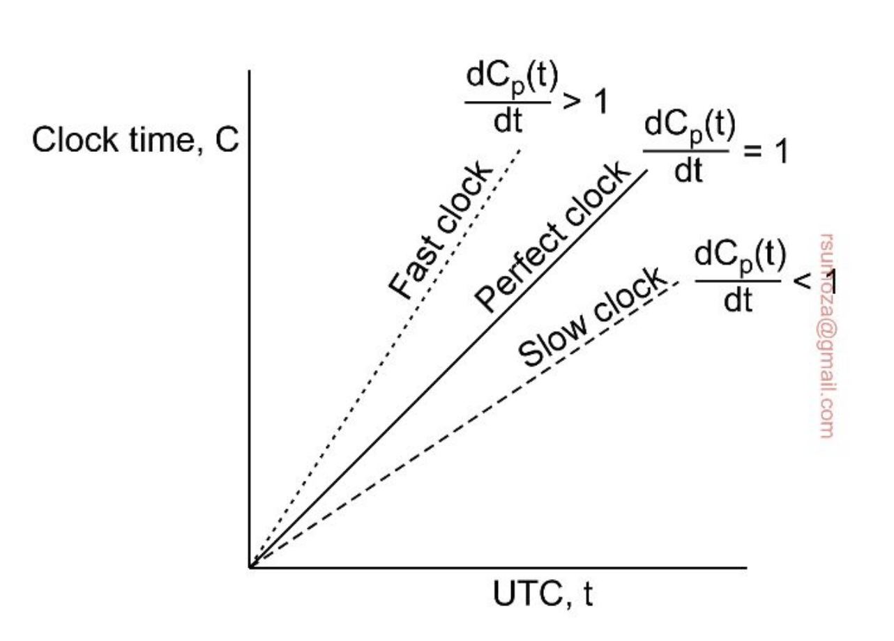

### Algoritmos de sincronización
#### NTP (Network Time Protocol)
El Unix TimeStamp tiene el 0 (el primero de todos) en el 01/01/1970
- Una solución es tener un **timeserver** que se encarga de decirnos qué hora es.
- Pero como **los delays de la red no son despreciables**, tenemos que tenerlos en cuenta también de forma de actualizar el reloj con el valor que nos da el server más un offset.
  - No es trivial el tiempo que tarda en llegar la response.
- Si el tiempo del server es anterior al actual hay que ralentizar el reloj local
- En NTP particularmente hay un atributo de los relojes que es el **estrato**, que nos dice qué tan confiable es el reloj.
  - El **estrato 0** es **el reloj en particular** (UTC, relojes atómicos). Son lo más exacto que hay
    - Este estrato **sólo se consigue si tenés hardware que lo permita** (es decir, tenés literalmente el reloj en particular)
  - El **estrato 1** es el **servidor que existe alrededor** del reloj puntual. Son servidores con mecanismos confiables.
  - De acá para abajo (hasta N) baja la confiabilidad y la exactitud.

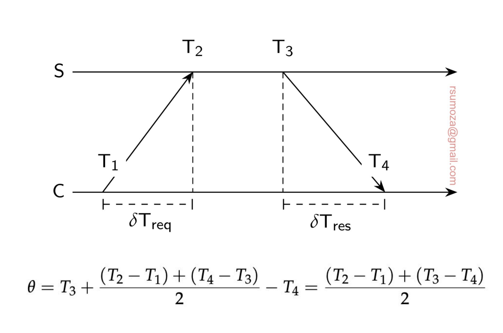

## Relojes lógicos
- Si nos interesa llevar un registro con exactitud, una solución como NTP es necesaria.
- Si todos estamos de acuerdo que A pasa antes que B, y B pasa antes que C, ya nos ponemos de acuerdo con cómo fueron las cosas, entonces no hay duda entre los procesos de cuál es el orden correcto
- Nos desacoplamos del tiempo, y nos fijamos específicamente en los eventos y su orden.
  - Me importa lo que pasó y en qué orden, no cuándo pasó.

**Lamport**
- Si dos procesos no interactúan entonces no es necesario que estén coordinados. Su falta de sincronización no es observable, y por ende no genera problemas.
  - No me interesa saber en qué orden pasaron las cosas si los procesos no se comunican entre sí.
- Para procesos que interactúan entre sí, Lamport define el **happens-before**
  - a $\rightarrow$ b. A pasa antes que B.
- Hay 2 reglas para el **happens-before**.
  - Si A y B ocurren dentro de un mismo proceso, y A ocurre antes que B, entonces A $\rightarrow$ B es cierto.
  - Si A es el evento en el que un proceso **envía un mensaje X**, y B es el evento en el que **otro proceso recibe el mensaje X**, entonces A $\rightarrow$ B es cierto. _Un mensaje no puede recibirse antes de ser enviado_.
- Happens-before es transitivo (A $\rightarrow$ B y B $\rightarrow$ C $\Longrightarrow$ A $\rightarrow$ C)
- Si ni X $\rightarrow$ Y ni Y $\rightarrow$ X, entonces X e Y son concurrentes.

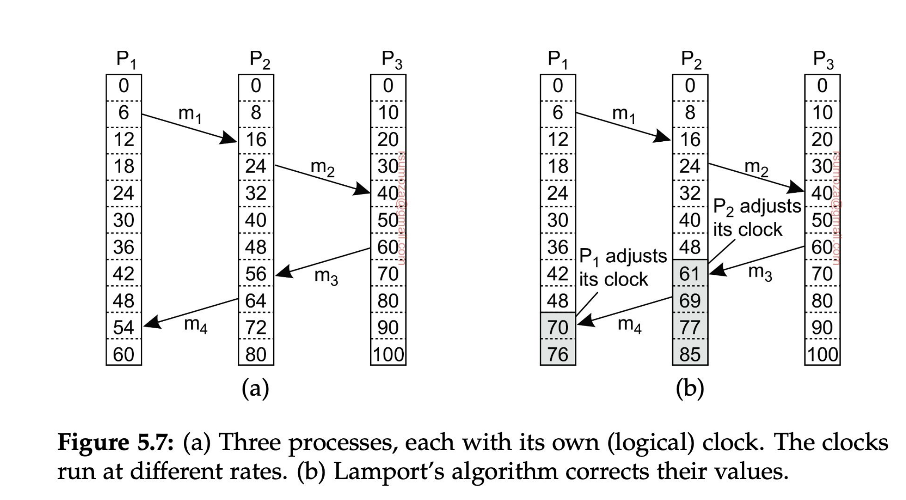
- Fíjense en la figura de la derecha que los relojes se **auto-ajustan** porque, por definición de Lamport, es imposible recibir un mensaje antes de que se haya enviado.
- Por tanto, los relojes le agregan uno al momento en el que salió el mensaje desde el otro proceso.

### Relojes de vectores
Los relojes lógicos tienen un problema subyacente: 
- Con los relojes lógicos tenemos mensajes que van y vuelven por el mismo camino, a través del cual puedo rearmar la causalidad. 
- ¿Qué pasa cuando tengo muchísimas interacciones/eventos? ¿Y si tenemos eventos que existen no sólo por comunicación sino que son generados por el proceso per se?
  - Seguir la causalidad en estos casos es un bodrio, es casi imposible.
  - ¿La solución? $\Longrightarrow$ Un reloj de vectores.
  
Nosotros sabemos cuántos procesos existen, y por cada posición de ese vector que usamos como reloj tenemos un proceso.
- Cada proceso mantiene un contador de eventos asociados a c/u de los procesos
- Entonces en todo momento cada proceso tiene su versión local del clock de todos los procesos.
- Si llega una nueva versión con valores más altos para cualquier posición en comparación con la local, se actualiza.

Cuando detectamos un conflicto en la sincronización de los relojes de vectores, tenemos que tomar alguna decisión arbitraria.
El manejo de conflictos es muy similar al de los VCS (Git, por ejemplo).

Podemos determinar la posible precedencia de 2 eventos en base a la siguiente proposición:

Sea $V_1 = [x_1, y_1, z_1]$ y $V_2 = [x_2, y_2, z_2]$. Decimos que $V_1 > V_2$ si para toda posición $i$ se cumple que $v_{1,i} \geq v_{2,i}$, y además existe al menos una posición $j$ tal que $v_{1,j} > v_{2,j}$. Es decir, todos los elementos pueden ser iguales o mayores, pero al menos uno debe ser estrictamente mayor; si esto no se cumple, no se puede definir una relación de precedencia estricta entre los vectores.

>A efectos de este ejemplo, se usan sólo 3 procesos para el reloj, pero en un caso real pueden haber N procesos participando.

Sobre el papel, es muy difícil determinar la causalidad de manera definitiva, por lo que decimos que si A ocurre antes que B, **B pudo haber sido causado por A**, pero no asegurarlo.

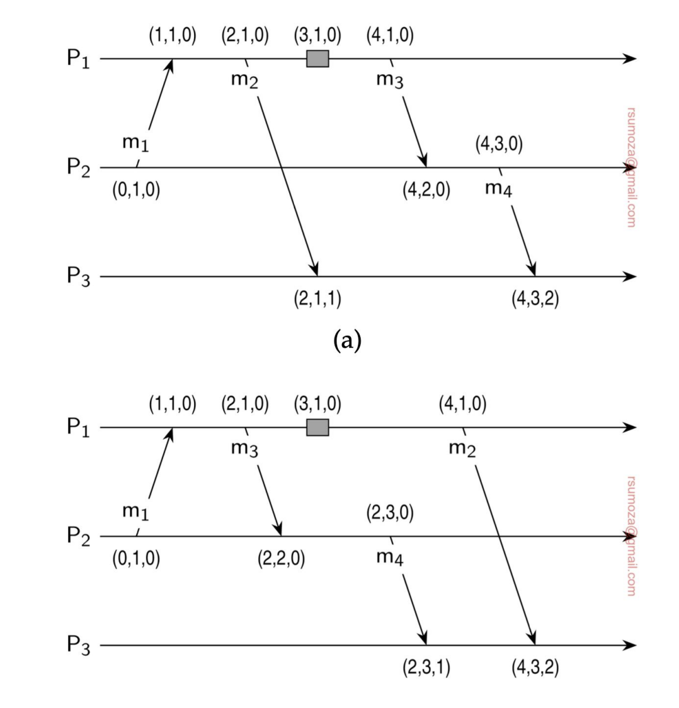
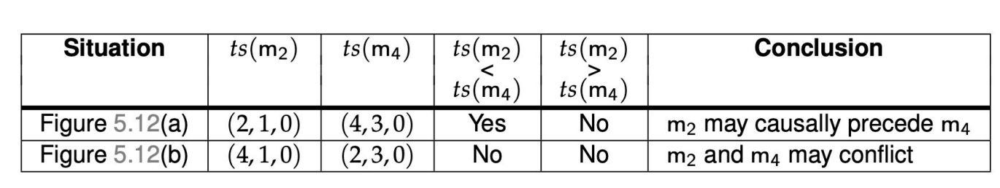

## Exclusión mutua
Hay alguien que tiene el control sobre el recurso en este momento, en principio nadie más puede leerlo ni modificarlo.

Podemos empezar a determinar roles en estos casos, para determinar un esquema de jerarquía sobre los recursos.

### Solución centralizada
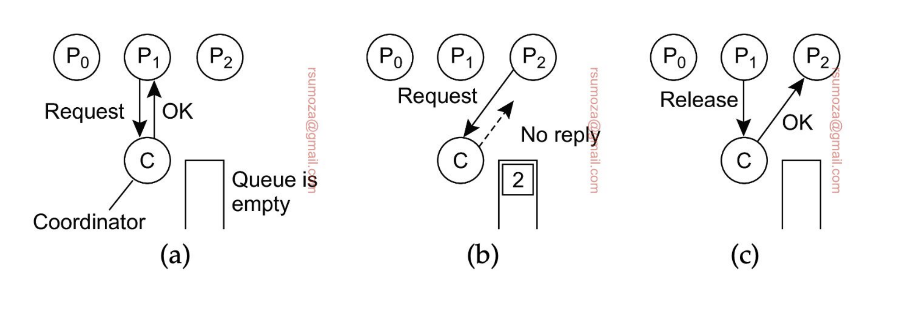
- El coordinador (uno solo) es el que se encarga de proteger/administrar el recurso
- El resto de procesos le piden acceso al recurso.
  - Si me dice OK, puedo acceder al recurso
- Si otro proceso quiere acceder al mismo tiempo que otro, no se le responde nada, y se encola.
  - Cuando se libere el recurso, se le manda un OK al proceso encolado

**Problema subyacente**: se genera un SPoF (Single Point of Failure), el cual es el _coordinador_. Si se muere el coordinador y se quiere recuperar, se puede llegar a perder la Queue, dando lugar a la posibilidad de generar Starvation.

**Beneficio**: es simple, fácil de entender, administrar, implementar, es sencillo debuggearlo.

### Solución distribuida - Algoritmo de Ricart
> El algoritmo de Ricart original consiste en que cuando un nodo necesita acceder a un recurso, le pide permiso a todos los nodos del sistema. Si al menos uno le contesta que no, no opera.
> El que vemos es una optimización sobre Ricart que hace uso de los timestamp.

- Cuando un proceso quiere acceder a un recurso compartido, envía un mensaje con el nombre del recurso, su ID y su timestamp a todos los nodos (incluso a sí mismo).
- Luego, hay 3 escenarios diferentes para cada nodo:
  - Si no quiere acceder a ese recurso devuelve un OK
  - Si tiene acceso al recurso, encola el mensaje y no responde nada
  - Si quiere acceder al recurso pero todavía no lo hizo, compara su mensaje con el que recibió.
    - El que tenga el timestamp más chico, gana. Se basa 100% en el orden en el que se envían los mensajes.
    - Si gana el mensaje entrante, devuelve un OK. Si no, encola el mensaje
- Un proceso sólo va a acceder al recurso cuando haya recibido un OK de todos los otros procesos.

¿Cómo se da cuenta si él mismo quiere acceder al recurso? $\Longrightarrow$ Se fija en la queue interna si tiene un mensaje suyo.

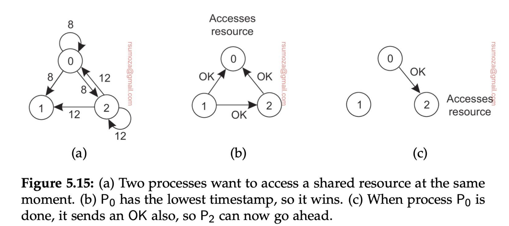

Se puede dar starvation en el caso de que el timestamp de 0 siempre sea más chico que 2 y que los procesos estén desordenados. Esto claramente no va a pasar si usamos una Queue bien estructurada, ya que los procesos se van a ordenar.

**Problema**: Si uno de los procesos se cae, se bloquean todos.

### Solución distribuida - Token Ring
Es un anillo en el que se van a organizar los procesos. En principio, un proceso sólo conoce el próximo proceso.

En exclusión mutua, tenemos 2 escenarios:
- **Token Based**: se usa un token (llave) para habilitar el acceso a recursos
  - El token tiene que ser difícil de replicar.
- **Permission Based**: en algún momento conseguimos el permiso del resto de los nodos. El ejemplo anterior es permission-based

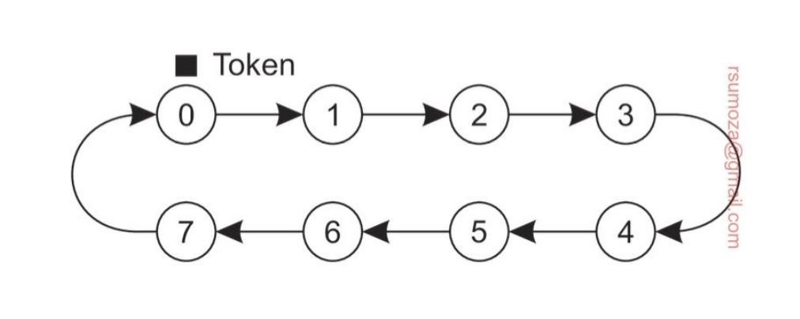
- Cuando el anillo se inicializa, a uno de los procesos se le da el token. Si en ese momento quiere usar el recurso puede hacerlo, y cuando termina pasa el token al siguiente del anillo. Está prohibido que use el token inmediatamente después de haberlo usado.
- Si al recibir el token el proceso no quiere acceder al recurso, simplemente pasa el token
- **Problema**: Si se pierde el token, ¿cuándo se regenera?
  - Puedo tener también problemas de espera en función del tamaño del anillo.
- **Beneficio**: evitamos starvation porque el token tiene que pasar de mano y, si uso el mismo token puedo evitar el deadlock.

## Algoritmos de elección
Los necesitamos para poder entender más adelante cosas que vamos a ver al final de la materia.

- Muchos algoritmos distribuidos requieren la existencia de un nodo coordinador. Pero, ¿cómo nos ponemos de acuerdo en quién es el coordinador?
- Los nodos tienen que tener algún mecanismo para elegir y ponerse de acuerdo en cuál es el coordinador
- Para poder diferenciar a los nodos es necesario que todos tengan un ID único
- En general lo que se hace es designar como coordinador al proceso con ID más grande.
- Además es importante que todos los nodos conozcan al resto de nodos. Lo que pueden no conocer es su estado.

Vamos a usar 2 criterios para elegir un coordinador:
- Todos los nodos se conocen entre sí
- El coordinador es el del ID más grande
  - Es ineficiente cuando hablamos a gran escala

Los escenarios en los cuales vamos a usar algoritmos de elección son:
- Cuando se cayó el último coordinador
- Cuando se inicializa el sistema y no está decidido el coordinador

### Algoritmo bully
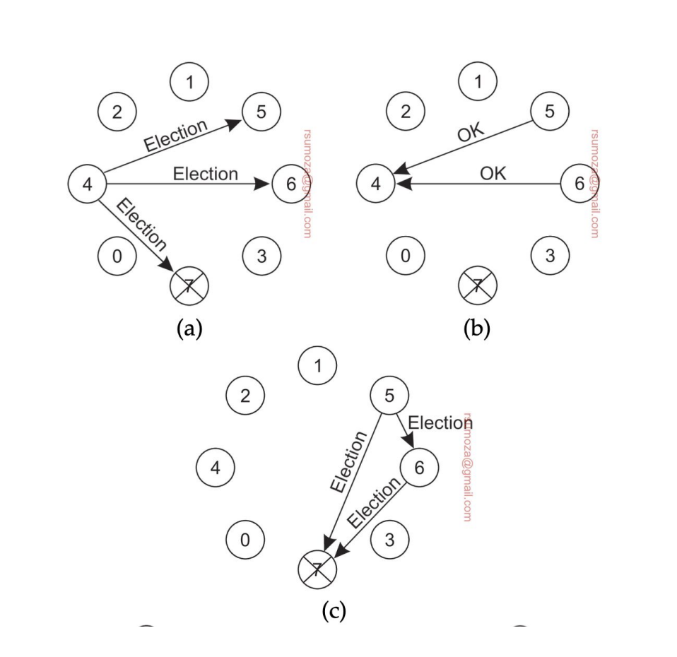
- Cuando un proceso detecta que el coordinador no responde, **inicia una elección**
- Envía un mensaje de elección a todos los nodos con ID mayor al suyo
  - No me interesan los nodos más chicos que el nodo que inicia la votación
- Si ninguno responde, este nodo gana la elección
- Si alguno responde significa que ese nodo se encarga de seguir la elección, repitiendo el mismo proceso.
- Si algún proceso se recupera o se suma al sistema, arranca otra elección
  - Si el que aparece es el del ID más grande, le manda un mensaje a todos los nodos diciendo que **él es el coordinador**.
  - Si el que aparece es el más chico, arranca la votación de vuelta.
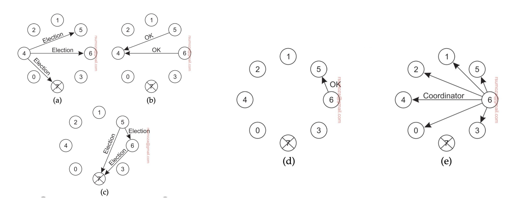

### Algoritmo del anillo
Que el sistema esté diseñado como un anillo no implica que la red de elección sea en forma de anillo. **Son 2 cosas inherentemente diferentes**.

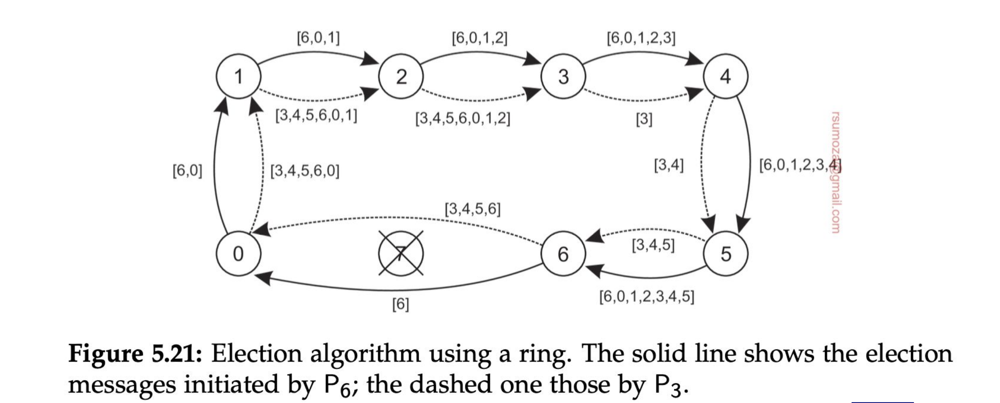

- Los nodos se organizan en una overlay network con forma de anillo.
- Cuando un nodo detecta que el coordinador no está funcionando, empieza una elección enviando un mensaje ELECTION con su ID al próximo proceso.
- Cada proceso suma su ID a la lista, y envía el mensaje al próximo proceso
- Finalmente el proceso que originó la elección recibe una lista con su propio ID. De todos los IDs, se selecciona el más grande, y lo comparte con un mensaje COORDINATOR con el próximo elemento, a lo largo de todo el anillo.
- Si cualquier nodo no responde el mensaje se envía al próximo proceso que esté funcionando del anillo.

Si 2 nodos detectan en simultáneo que se cayó el coordinador y arrancan la elección, el **resultado va a ser el mismo**, solamente va a haber más pasamanos porque van a haber 2 listas circulando.

Cada nodo que se anota en la lista, por más que sepa que no va a ser el coordinador, se anota para notificarle al resto que está vivo.

### Algoritmo de Raft
Es un algoritmo basado en términos. Hay **momentos** para elecciones.
Una elección arranca en el momento A y termina en el momento B, existe una ventana de tiempo.

Ningún nodo tiene ninguna jerarquía, solo se determina por quién pide ser coordinador.\
Este algoritmo falla cuando más de un nodo pide ser coordinador.

### Sistemas de gran escala - Proof of work
Hay un líder que le dice al resto "la versión real es esta".
- **Hashing**: toma un input cualquiera y produce una cantidad fija de bits. Calcular un hash debería ser barato computacionalmente. Pero calcular un input al que le corresponda el mismo hash. Y siempre o casi siempre, sin importar cuán mínima sea la diferencia, si dos inputs son diferentes van a producir hashes diferentes.
- Entonces es muy fácil garantizar que cualquier cambio a la blockchain va a generar un hash necesariamente diferente
- Esto hace que modificar la blockchain sin que el resto de los validadores se den cuenta sea prácticamente imposible.
- Cada validador produce un hash para el nodo que está procesando, que se llama **digest**.
- El desafío es calcular el **nonce**: un valor que, cuando se combina con el digest y se hashea, produce un valor con una cierta cantidad de ceros consecutivos al principio del hash final.
- El validador que lo encuentre primero pasa a ser líder, pero la probabilidad de encontrar un nonce válido es de $\frac{1}{5 \times 10^{17}}$
- En general este proceso suele tomar 10 minutos a nivel global
  - Un nodo encontró un nonce a nivel global. 
- Esto puede ajustarse cambiando la cantidad de ceros que se piden (suelen ser 64 ceros) de forma buscar un balance entre el tiempo que se tarda en calcular y posibles conflictos.

### Elecciones en sistemas wireless
- Muchas de las propiedades que asumimos como ciertas en otros escenarios (los mensajes siempre llegan, la topología no cambia, la red es confiable) no son ciertas para sistemas wireless.
- Necesitamos un algoritmo capaz de elegir al _mejor nodo_
- Para eso, necesitamos un algoritmo que pueda conseguir información de todos los nodos disponibles en ese momento.
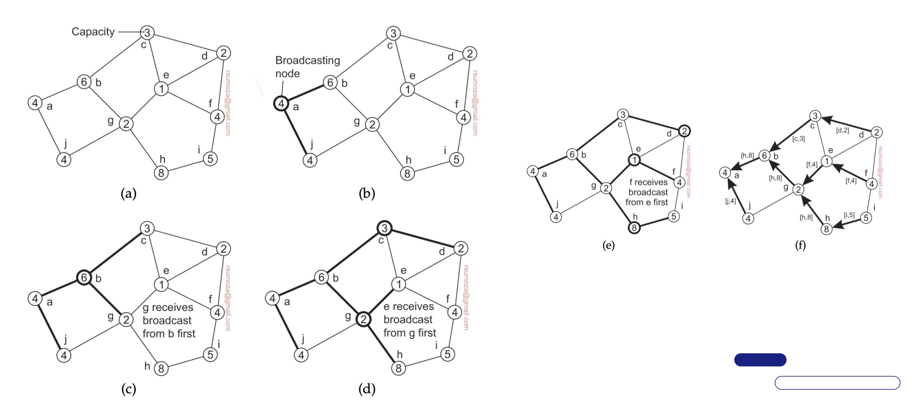
