# Naming
## Conceptos básicos
1. Los nombres juegan un papel importante en todos los sistemas informáticos
2. Se usan comúnmente para compartir recursos, identificar entidades de manera única, hacer referencia a ubicaciones y más.
3. Se traduce como "nombramiento" o "designación".

Todos los servicios de Internet necesitan un esquema de direccionamiento para poder ubicar un recurso.

La resolución de nombres se distribuye a través de múltiples nodos.

4. Un nombre puede resolver la entidad a la que se refiere
5. De esta forma la resolución de nombres permite que un proceso acceda a la entidad nombrada.
6. Para resolver nombres, es necesario implementar un sistema de nombres
7. La diferencia entre los nombres de los sist. distribuidos y no distribuidos radica en **la forma en la que se implementan los sistemas de naming**
   - Los sistemas distribuidos implementan el sistema de naming de manera distribuida en múltiples máquinas
   - En los no distribuidos los nombres están centralizados en un nodo.

Para los fines de esta materia se considerarán 3 tipos de sistemas distribuidos de naming:
1. **Flat Naming System** (Sistema de direccionamiento plano)
   1. Se suele implementar en redes P2P (punto a punto) porque normalmente incorporan la información de las redes de los nodos vecinos
      1. Van haciendo un "teléfono descompuesto" basado en preguntar "¿vos tenés este recurso?"
   2. Ejemplo: BitTorrent.
   3. No hay un servidor centralizado que tiene todo, sino que la info está distribuida entre nodos.
   4. Los sistemas están preparados para la desconexión
2. **Structured names** (nombres estructurados, como por ejemplo DNS)
3. **Named Based Routing** (enrutamientoi basado en nombres o características)

> Pregunta de parcial: ¿DNS se puede aplicar sólo en Internet?
> 
> <u>Respuesta</u>: **No**, se puede aplicar a nivel organizacional y poner nombres puntuales a recursos dentro del dominio de una empresa, por ejemplo.

- Los nombres se usan para designar entidades en un sistema distribuido
- Para operar con una entidad, necesitamos acceder a ella mediante un punto de acceso
- Los puntos de acceso son entidades que se nombran mediante una dirección
- Una entidad puede ofrecer más de un punto de acceso
  - Ej: puedo contactarme con Juan a través de su celular o de su teléfono de línea
  - 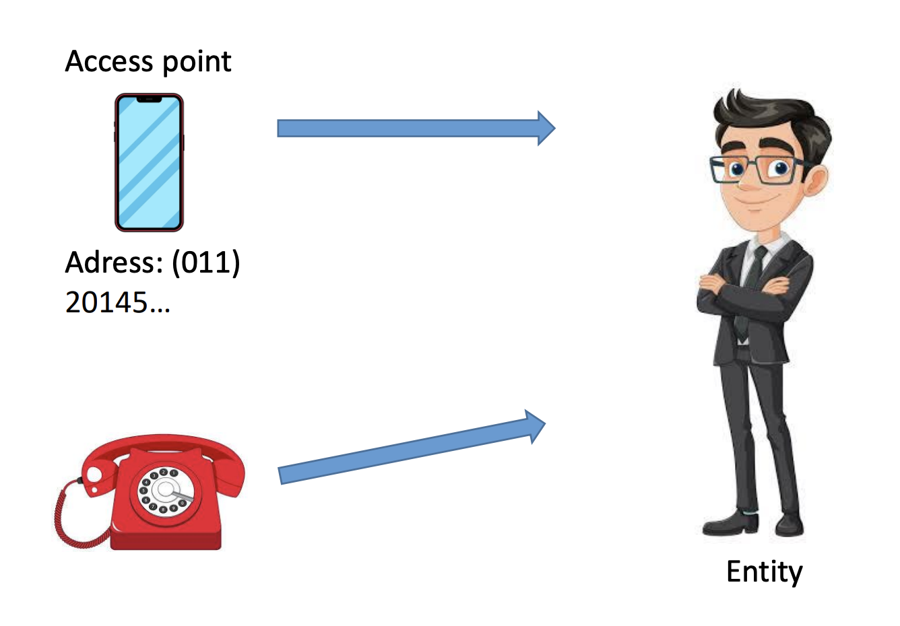

En un sistema distribuido, un ejemplo típico de un punto de acceso es un host que ejecuta un servidor específico, con su dirección formada por la combinación de, por ejemplo, una dirección IP y un número de puerto.

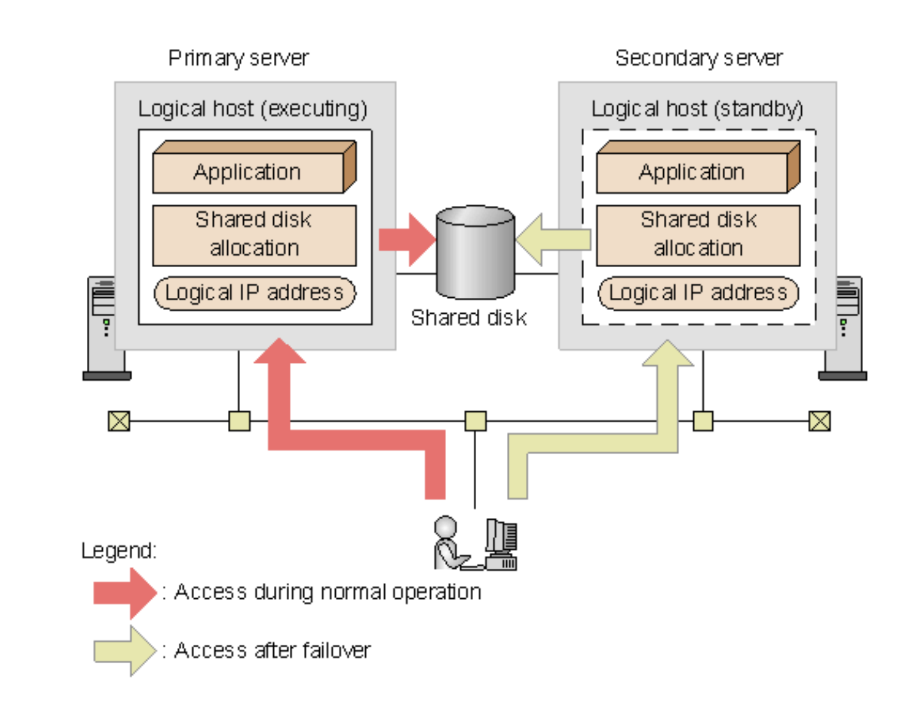

- Del mismo modo, si una entidad ofrece más de un punto de acceso, no queda claro qué dirección usar como referencia.
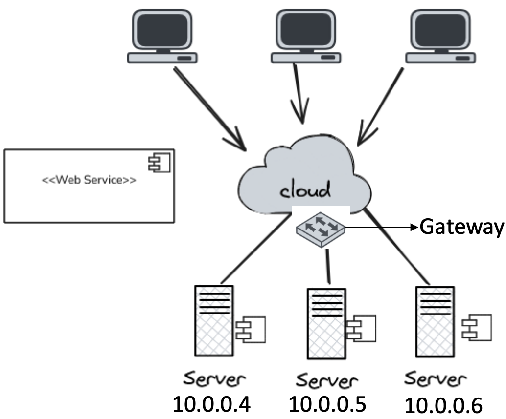

**Gateway**: puerta de enlace o de salida. En este caso me va a permitir redireccionar cada cliente a cada servidor, o avisarme 

- Una solución mucho mejor es tener un solo nombre para el servicio web, independientemente de las direcciones de los diferentes servidores web. (De esta manera, va a ser un esquema simplificado)

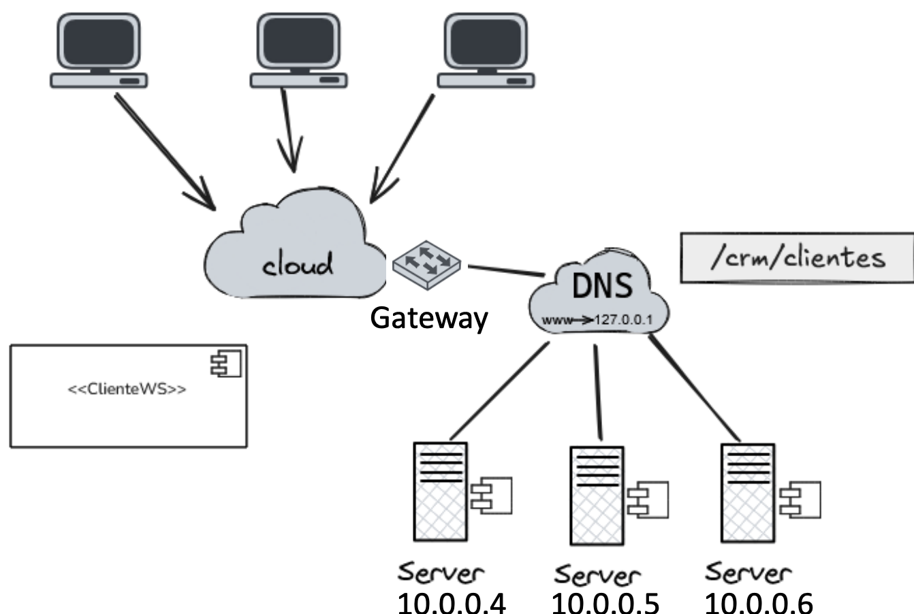
- Esta variante es independiente de la ubicación (en cuanto a su dirección IP)

Estos ejemplos ilustran que un nombre para una entidad que sea independiente de sus direcciones suele ser mucho más fácil y flexible de usar

Este tipo de nombre se denomina **independiente de la ubicación**.

Las direcciones y los identificadores.son dos tipos importantes de nombres que se utilizan para propósitos muy diferentes.

Otro tipo importante de nombre es el que está diseñado para ser usado por humanos, también conocidos como nombres amigables para los humanos (como los nombres DNS).

## ¿Cómo resolvemos nombres e identificadores en direcciones?
Tanenbuam presenta 2 enfoques:
- Mantener una tabla (generalmente distribuida) de pares (nombre, dirección). DNS usa este enfoque
- En el segundo enfoque, un nombre se resuelve enrutando la solicitud gradualmente a la dirección asociada al nombre o incluso directamente a un punto de acceso. Usualmente utilizado en sistemas estructurados de pares (peer-to-peer).

### Flat Naming System
En estos sistemas existe un identificador que en principio no tiene mucho significado ni estructura, por lo que necesitamos una forma de rastrear la entidad.

No tienen estructura, lo que implica que necesitamos mecanismos especiales para rastrear la ubicación de dichas entidades.

A menudo, los identificadores son simplemente cadenas de bits aleatorias, a las que nos referimos convenientemente como nombres no estructurados o planos.

No tiene información de cómo llegar al punto de acceso desde la entidad asociada.

Tenemos 2 soluciones para alcanzar una entidad:
- Fordwarding pointers (punteros de difusión)
- Broadcasting

**Ambas soluciones son aplicables principalmente sólo a redes de área local.**

El router me permite saltar entre redes, pero el switch no. La información queda dentro de la red del switch, a menos que sea un _switch de Capa 3_.

#### Broadcast
Difundir el ID (por Broadcast), solicitando a la entidad que devuelva su dirección actual
- Nunca puede escalar más allá de las redes de área local
- Requiere que todos los procesos escuchen las solicitudes de ubicación entrantes

**ARP (Address Resolution Protocol)**
- Para saber qué dirección MAC está asociada con una dirección IP, hay que hacer broadcast de la consulta "¿quién tiene esta IP?"

> Capa de enlace (OSI) maneja direcciones MAC.
> 
> `arp -d`: borra la tabla de direcciones

### Forwarding pointers (punteros de reenvío)
Cuando una entidad se mueve, deja atrás un puntero que indica su próxima ubicación.
- La desreferenciación puede ser completamente transparente para los clientes siguiendo la cadena de punteros
- Se debe actualizar la referencia de un cliente al encontrar su ubicación actual
- Problemas de escalabilidad geográfica (para los que se requieren mecanismos de reducción de cadena independientes):
  - Las cadenas largas no toleran fallos
  - Mayor latencia de red al desreferenciar

### Home based approach (enfoque basado en origen)
Tengo una cierta cantidad de ubicaciones fijas, que de alguna manera reenvían la información.

Las ubicaciones fijas redireccionan las IP en una cierta **ubicación de origen**, de manera que no tenga que armar cadenas demasiado largas.

- Se realiza un seguimiento de la ubicación actual de una entidad
- El enfoque basado en el origen se usa como mecanismo de respaldo para los servicios de ubicación basados en punteros de reenvío
- Otro ejemplo donde se sigue el enfoque basado en el origen es en **IP móvil** (para dispositivos móviles). Cada host móvil tiene una dirección IP fija.
  - Los datos móviles te permiten conectarte de manera directa con el proveedor de servicios (Movistar, Personal, etc.)

Esquema de un solo nivel: permitir que un home (origen) lleve un registro de dónde se encuentra la entidad
- La dirección de origen (home address) de la entidad registrado en un servicio de nombres
- El origen (home) registra la dirección externa de la entidad.
- El cliente contacta primero con el origen (home) y luego con la ubicación foránea o externa (foreign location).

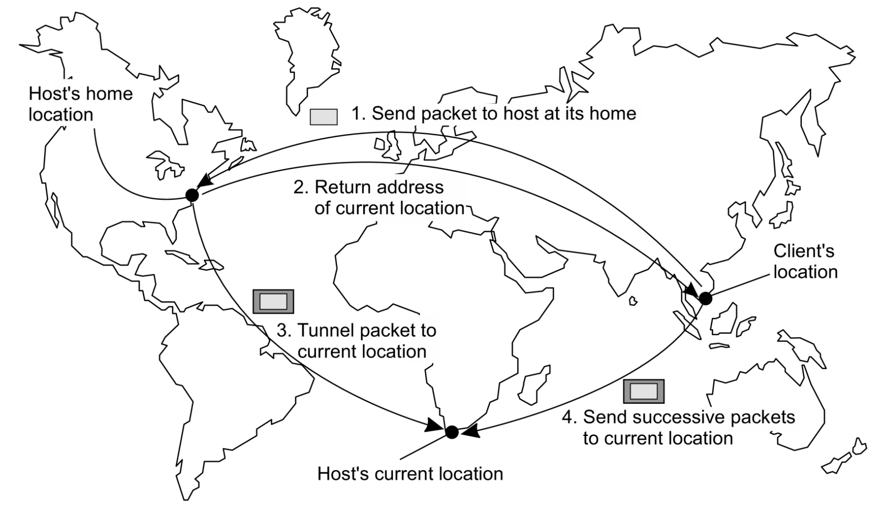

#### Problemas
- La dirección particular debe mantenerse durante toda la vida útil de la entidad
- La dirección particular es fija $\Longrightarrow$ una carga innecesaria si la entidad se muda permanentemente
- Baja escalabilidad geográfica (la entidad puede estar junto al cliente).

### Distributed Hash Tables
- Cuando necesito comunicarme con una entidad móvil, el cliente primero debe contactar con su origen, que puede estar en una ubicación completamente distinta a la de la propia entidad.
- Esto provoca un aumento de la latencia de la comunicación.

**Cómo resolver un identificador en la dirección de la entidad asociada.**
- En la última década se han desarrollado muchos sistemas basados en DHT.
- El sistema Chord (cuerda/anillo) es un representante típico
  - Cada miembro del anillo tiene un puntero al siguiente miembro, y una tabla que muestra, en cada miembro, 

### Sistemas de ubicación jerárquica (HLS)
- Construir un árbol de búsqueda a gran escala cuya red subyacente se divide en dominios jerárquicos
- Cada "dominio" está representado por un nodo de directorio independiente
- Tener un espacio de nombres dividido acelera el tiempo de búsqueda.
  - Tengo una frecuencia mayor de comunicación en un espacio reducido que en el espacio total.

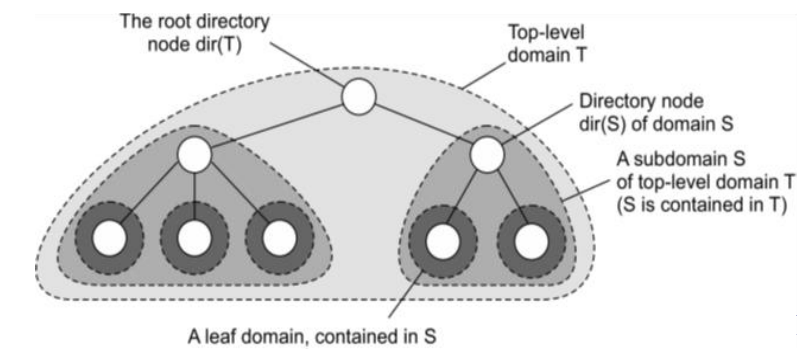

> No confundir con DNS; DNS usa nombres fáciles para el usuario, mientras que HLS sigue manejándose por direcciones IP.

#### Nomenclatura de HLS
Invariantes:
- La dirección de la entidad E se almacena en un nodo hoja o intermedio
- Los nodos intermedios tienen un punteor a un hijo $\Longleftrightarrow$ el subárbol con raíz en el hijo almacena la dirección de la entidad
- La raíz conoce todas las entidades
- Cada nodo tiene un puntero al padre

#### Almacenamiento de información de una entidad con 2 direcciones en diferentes dominios hoja

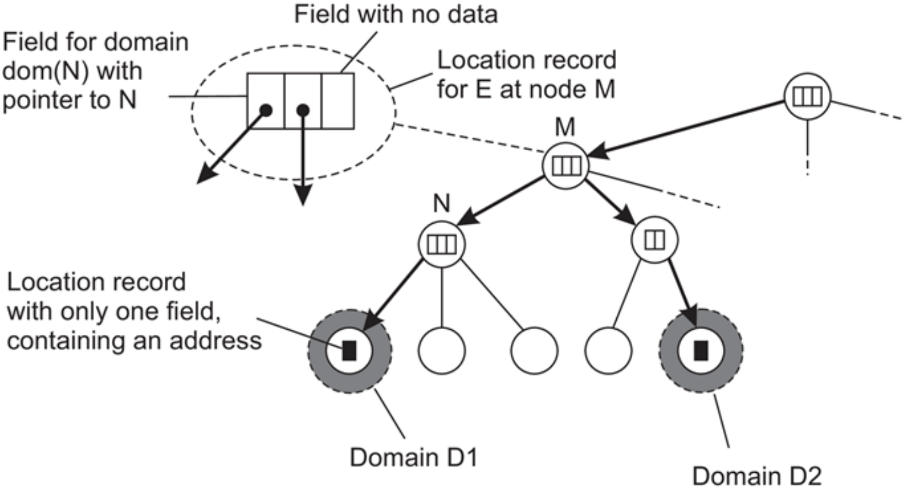

#### Buscando una ubicación
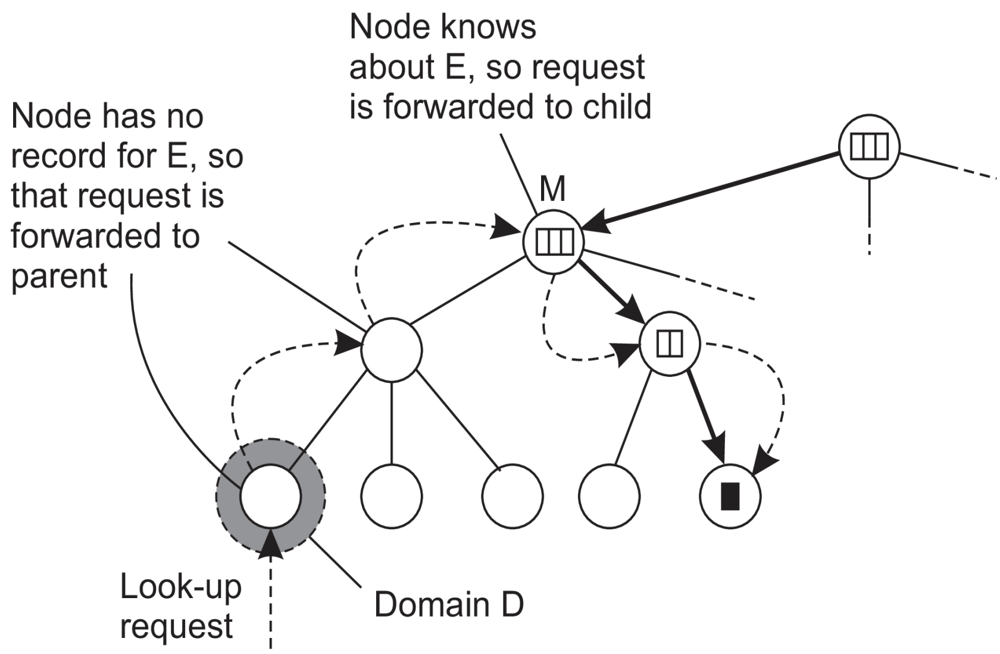

#### Principios básicos de HLS
- Iniciar la búsquead en el nodo hoja local
- Si el nodo conoce E $\Longrightarrow$ sigue el puntero hacia abajo; de lo contrario, sube
- La búsqueda hacia arriba siempre frena en la raíz

#### Escalabilidad
- Es importante distinguir entre un diseño lógico y su implementación física
- Veamos como podemos llegar a una implementación altaente escalable de un servicio de ubicación jerárquico
- $D_k = {D_(k1), D_(k2), D_(k3), ..., D_(k,Nk)}$ denota los $Nk$ dominios en el nivel $k$
- Para cada nivel $k$, el conjunto de hosts se divide en $N_k$ subconjuntos, y cada host ejecuta un servidor de ubicación que representa exactamente uno de los dominios $D_(k,i)$ de $D_k$

#### Principio de distribución de servidores de ubicación lógicos
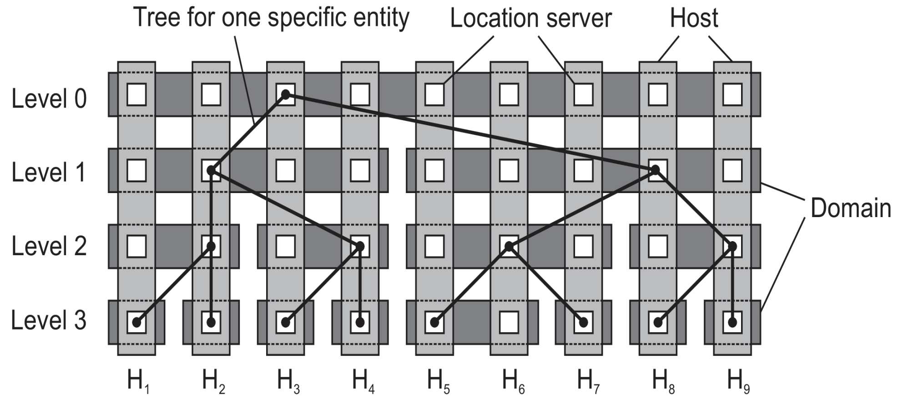

#### Seguridad en Flat Naming
- No hay información sobre cómo resolver un nombre a la entidad a la que hace referencia
- Por lo tanto, es necesario confiar completamente en el proceso de resolución de nombres para finalmente acceder a la entidad asociada
- ¿Qué pasa si el esquema de resolución de nombres del cual dependemos no es confiable?

Tenemos 2 opciones:
- Asegurar el proceso de resolución de nombres
  - Es el más complicado porque estoy dependiendo de otro sistema
- Asegurar la asociación entre el identificador y la entidad
  - Tengo una forma de autenticar a quien se está conectando
  - Es un bodrio autenticar a nivel IP porque es un sistema de búsqueda.
    - Existen ataques del tipo `ARP Flooding` que consisten en inundar la red de solicitudes ARP.

##### Asegurar la asociación entre el identificador y la entidad
- Ocurre en un nombre autocertificado
- Como principio general, podemos calcular un identificador de una entidad simplemente usando una función hash
- $id(entidad) = hash(datos asociados a la entidad)$
  - Se le da un hash a cada uno, y si coincide el hash con el que se le dio la dirección, está diciendo la verdad
  - Es parecido a la dirección de email, que es irreplicable

### Structured Naming
Los nombres planos son buenos para las máquinas, pero generalmente no son muy convenientes para el uso humano.

Como alternativa, los sistemas de nombres generalmente admiten nombres estructurados.
- Se componen de nombres simples y legibles para humanos.
- Nombres de archivos y hosts en Internet siguen este enfoque.

#### Name Spaces
Se pueden representar como un grafo dirigido y etiquetado con dos tipos de nodos.
- **Leaf node (Nodo hoja)**: Un nodo hoja representa una entidad nombrada y no tiene aristas salientes. Mantiene información representativa de la entidad (ej: dirección).
- **Directory node (nodo directorio)**: tiene varias aristas salientes, cada una etiquetada con un nombre. Cada nodo en un grafo de nombres se considera como otra entidad en un sistema distribuido.

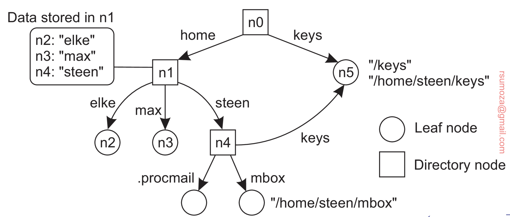

- Un nodo de directorio almacena una tabla en la que una arista de salida se representa como un par (identificador de nodo, etiqueta de arista).
- Dicha tabla se denomina **tabla de directorio**.

#### Name Resolution
- Los espacios de nombres ofrecen un mecanismo conveniente para almacenar y recuperar información sobre entidades a través de nombres.
- De manera más general, dado un nombre de ruta (route name), debería ser posible buscar cualquier información almacenada en el nodo al que hace referencia ese nombre.
- El proceso de buscar un nombre se llama **resolución de nombres**.

Se reduce a "_En base a un nombre, dame una IP_".

**Mecanismo de clausura**
- Sólo puede tener lugar si sabemos cómo y dónde empezar
- Saber cómo y dónde comenzar la resolución de nombres generalmente se conoce como **mecanismo de clausura**.
- Un mecanismo de clausura se ocupa de seleccionar el nodo inicial en un espacio de nombres, desde el cual debe comenzar la resolución de nombres.

#### Implementación de un espacio de nombres
- Un espacio de nombres forma el corazón de un servicio de nombres
- Es un servicio que permite a los uusarios y procesos agregar, eliminar y buscar nombres
- Un servicio de nombres se implementa mediante servidores de nombres
- En una LAN, se puede implementar un servicio de nombres con un sólo DNS
- En una WAN, se distribuye a través de varios DNS
  - Acá los espacios de nombres usualmente se organizan jerárquicamente
- Asumir que el espacio de nombres tiene un solo nodo raíz
- Para implementar eficazmente dicho espacio de nombres, es conveniente dividirlo en capas lógicas
  - **Capa global**: formada por nodos de nivel más alto
    - Comprende el nodo raíz y otros nodos de directorio lógicamente cercano s ala raíz, es decir, sus hijos directos
    - Los nodos representan organizaciones o grupos de ellas
    - Se me caen estos y se me cae todo
  - **Capa administrativa**: formada por nodos de directorio que, en conjunto, se gestionan dentro de una única organización. (Ej: la universidad y sus departamentos)
  - **Capa de dirección (Managerial layer)**: consta de nodos que suelen cambiar periódicamente. (Ej: nodos host, directorios y archivos)

#### DNS
- Usa el sistema de distribución por capas que mencionamos antes
- Es el sistema de resolución de nombres que usa actualmente internet
- DNS se usa para buscar direcciones IP de hosts y servidores de mail
- El namespace de DNS está organizado jerárquicamente como un árbol.

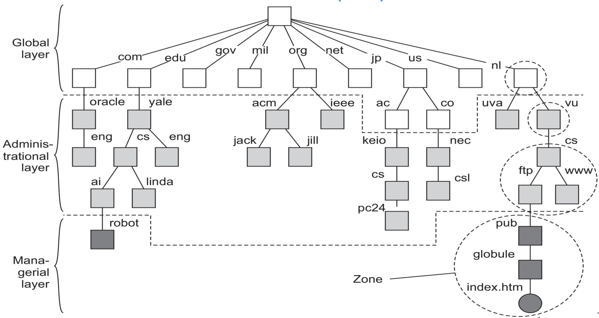

- Los subárboles son los dominios
- La ruta a su nodo raíz es el nombre de dominio
- La resolución de nombres se distribuye a través de varios servidores de dominio o "DNS servers"
- Para resolver un nombre, se comienza a leer desde adelante hacia atrás.

En esencia, el DNS namespace se puede dividir en una capa global y una administrativa:

> Nota: la capa de dirección (managerial layer) no es gestionada por el sistema DNS, por no ser formalmente parte de este sistema.

- Cada zona se implementa mediante un servidor de nombres, que prácticamente siempre se replica para garantizar la disponibilidad.
- Una base de datos DNS se implementa como una (pequeña) colección de archivos
- El más importante contiene todos los registros de recursos de todos los nodos en una zona particular.
- Este enfoque permite identificar los nodos de forma sencilla a través de su nombre de dominio

El contenido de un nodo está formado por una colección de registros de recursos.

Los más comunes para cada nodo son:
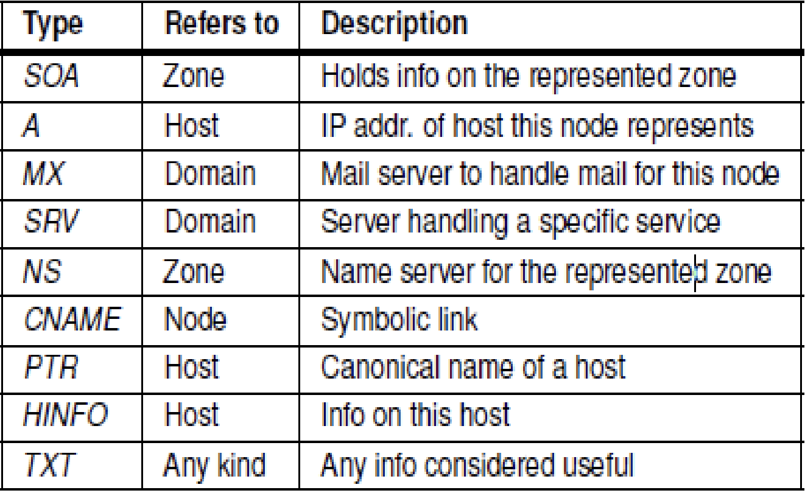

Al resolver un nombre para un nodo que se encuentra en el dominio `cs.vu.nl`, la resolución del nombre continuará en un punto determinado leyendo la base de datos DNS almacenada por el servidor de nombres para el dominio `cs.vu.nl`.

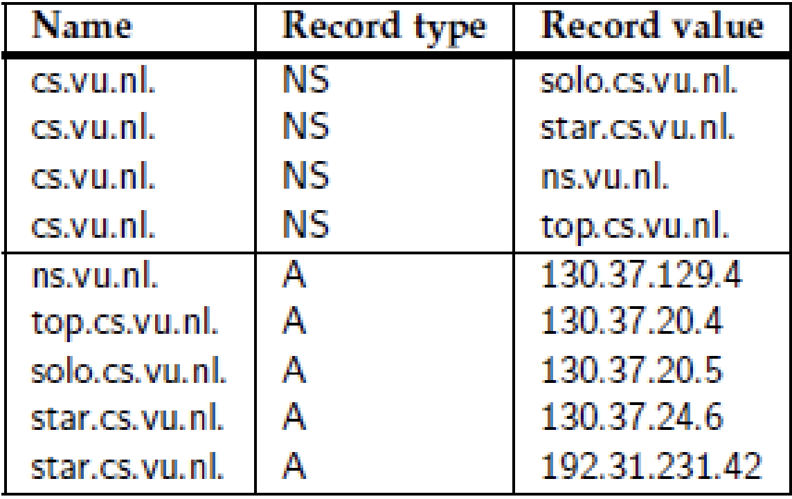

### Attribute-based Naming
- Los nombres planos y estructurados generalmente proporcionan una forma única e independiente de la ubicación para referirse a las entidades.
- Los nombres estructurados se han diseñado en parte para proporcionar una forma amigable para los humanos de nombrar entidades.
- En particular, a medida que se dispone de más información, se vuelve importante buscar entidades de manera efectiva.
- Este enfoque requiere que el usuario pueda proporcionar simplemente una descripción de lo que está buscando.
- Entre las formas en que se puede proveer descripciones, una forma popular en sistemas distribuidos es describir una entidad en términos de pares (atributo, valor).
- Generalmente se conoce como “attribute-based naming” (nombramiento basado en atributos).
- En este enfoque, se asume que una entidad tiene una colección de atributos asociada.
- Cada atributo dice **algo** acerca de la entidad.

#### Servicios de directorio
- Los sistemas de nombres basados en atributos también se conocen como **servicios de directorio**.
- Con los servicios de directorio, las entidades tienen un conjunto de atributos asociados que se pueden utilizar para realizar búsquedas.
- Para casos simples, por ejemplo, en un sistema de correo electrónico, los mensajes se pueden etiquetar con atributos para el remitente, el destinatario, el asunto, etc.
- Para casos más complejos, un ejemplo son determinados filtros de email.

**Desventajas**
- En la mayoría de los casos, el diseño de atributos debe realizarse manualmente.
- En la práctica, establecer valores de manera consistente por parte de un grupo diverso de personas es un problema en sí mismo. Por ejemplo, búsquedas en bases de datos de música y vídeo en Internet.
- Para aliviar algunos de estos problemas, se han llevado a cabo investigaciones para unificar las formas en que se pueden describir los recursos

**RDF**
- Un desarrollo relevante es Resource Description Framework (RDF).
- Fundamental para el modelo RDF es que los recursos se describen como tripletes que constan de un sujeto, un predicado y un objeto.
- Por ejemplo, (Persona, nombre, Alicia) describe un recurso denominado Persona cuyo nombre es Alicia.
- En RDF, cada sujeto, predicado u objeto puede ser un recurso en sí mismo
- Esto significa que Alice puede implementarse como una referencia a un archivo que puede recuperarse posteriormente.
- En el caso de un predicado, dicho recurso podría contener una descripción textual de ese predicado.
- Los recursos asociados a sujetos y objetos pueden ser cualquier cosa. Las referencias en RDF son esencialmente URLs.