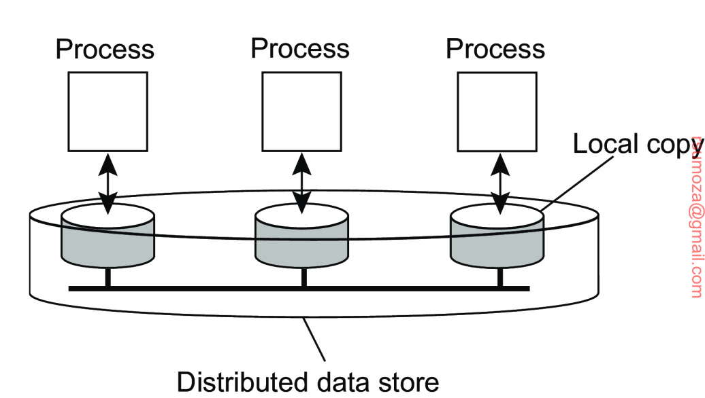
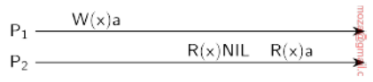
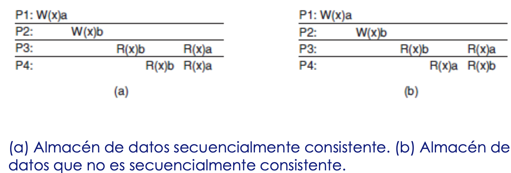
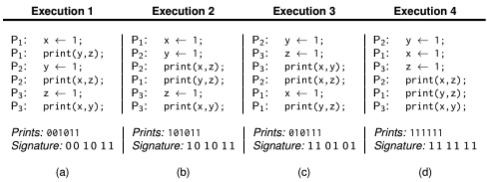
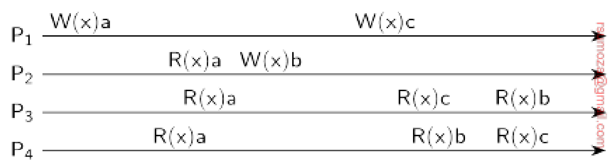
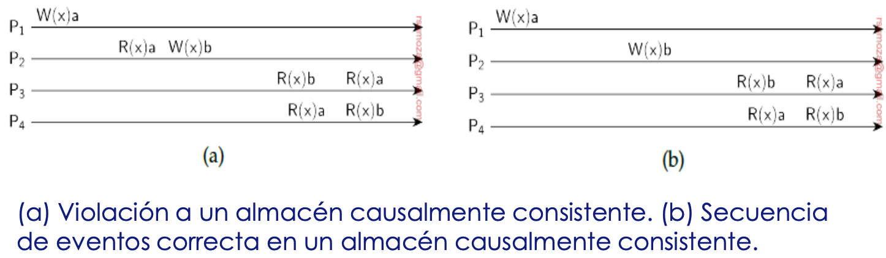
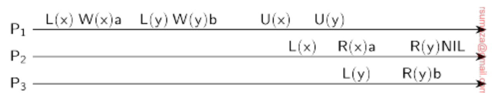
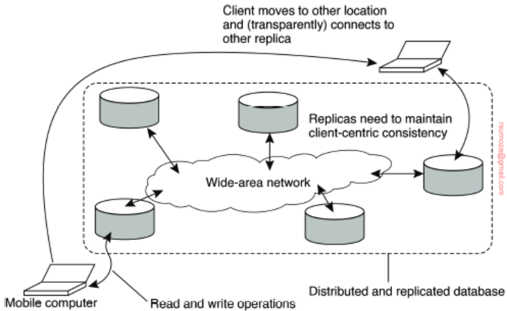

# Consistencia y Replicación
## Conceptos básicos
Los datos se replican para mejorar la confiabilidad o el rendimiento de un sistema.\
El problema principal es que las réplicas **sean consistentes entre si**.

- En estos modelos de consistencia, se supone que varios procesos acceden de manera concurrente a los datos compartidos
  - Esto implica _restricciones_ en cuanto a la **escalabilidad** del sistema.
- La consistencia en estas situaciones se puede formular en cuant a lo que pueden esperar los procesos al leer y actualizar los datos compartidos.
- Los procesos conocen que otros procesos tienen acceso a los datos compartidos

### Razones para replicar
1. Los datos se replican para aumentar la confiabilidad del sistema
   - Se puede replicar un sistema de archivos; cuando el principal se cae, el sistema puede seguir funcionando
2. La otra razón es por mejorar la performance del sistema
   - Un S.D puede necesitar escalar en términos del tamaño o del área geográfica que cubre
   - **Ej de Tamaño**: cada vez más procesos requieren acceder a los datos compartidos
     - En ese caso, puedo replicar para distribuir la carga del "sistema central"
### Desventajas
- Tener múltiples copias puede generar _problemas de consistencia_
- Cada vez que se modifica una copia, esa copia se vuelve distinta del resto
- Es necesario realizar cambios en todas las copias para garantizar la consistencia
- Exactamente cuándo y cómo deben realizarse esos cambios determina el costo de replicación
  - Cuanto más performante tiene que ser el proceso de replicación, mayor es el costo

### Replicación como técnica de escalabilidad
- Replicación y cacheo se usan ampliamente como técnicas de escalabilidad por cuestiones del aumento de rendimiento que implican
  - Ej: se puede configurar el TTL (Time To Live) de la copia en caché a partir de los headers de `HTTP` 
- Las restricciones de escalabilidad generalmetne aparecen en forma de problemas de rendimiento
- Colocar copias de datos cerca de los procesos que los usan puede mejorar el rendimiento mediante la reducción del tiempo de acceso. Y entonces se resuelven problemas de escalabilidad.
- Para mantener la copia actualizada, voy a requerir un mayor ancho de banda de la red. Claramente incurre un costo
- Mantener varias copias consistentes puede estar sujeto a problemas de escalabilidad serios
- Una colección de copias es consistente cuando varias copias terminan siendo las mismas
- Una operación de lectura realizada a cualquier copia siempre devolverá el mismo resultado

- Cuando se realiza una actualización, se tiene que propagar a todas las copias previo a realizar una operación posterior
- Esto debe ser independientemente de en qué copia se inicie o realice la operación
- Este tipo de consistencia se denomina (informalmente) como **consistencia hermética**. En el caso de replicación sincrónica.

> **Triggers de Bases de Datos**: son operaciones que se ejecutan cuando sucede un evento en particular. Ej: si escriben a la tabla `users`, hago una copia de todas las tablas previo a modificarla.

- La idea principal es que una actualización se realiza en toda slas copias como una sola operación atómica, o transacción.
- Implementar atomicidad involucrando una gran cantidad de réplicas, muy dispersas en una red de gran escala, es difícil cuando se necesita velocidad de operaciones.
- Las dificultades surgen cuando necesitamos sincronizar todas las réplicas.

## Modelos de consistencia centrados en los datos
### Conceptos
- **Almacén de datos (data store)**: el objeto que conforma los datos, que pueden estar compartidos.
  - El almacén de datos puede estar físicamente distribuido a través de múltiples máquinas.
  - Se asume que todo proceso que puede acceder a datos del almacén tiene una copia local (o en las cercanías)
  - Las operaciones de escritura se propagan hacia las otras copias

- Un **modelo de consistencia** es esencialmente un contrato entre los procesos y el almacén de datos (_data store_)
- Si los procesos aceptan obedecer ciertas reglas, el almacén promete funcionar correctamente
  - Se puede llamar también `nivel de consistencia`, porque el contrato determina el nivel de consistencia
- Sin un reloj global, es difícil definir precisamente cuál es la última operación de escritura
- Como alternativa, necesitamos proporconar otras definiciones, lo que nos lleva a una gama entera de modelos de consistencia
- cada modelo va a restringir los valores que puede devolver una operación de lectura sobre un elemento de datos
- La facilidad de uso es proporcional a los niveles de restricción de los modelos, pero es inversamente proporcional al rendimiento.
  - Entre más restrictivo, más fácil de usar pero peor anda. Y viceversa.
  
### Consistencia continua
-  Hasta el momento no hay una mejor solución para replicar los datos
-  Lo que podemos hacer cuando tenemos una distribución muy grande de replicacion es **dilatar la consistencia**.
   -  Refiere a "relajar" la consistencia, no hacer que sea instantáneo.
   -  Infiere una `consistencia eventual`. Puede llevarnos a soluciones eficientes.
-  Tampoco hay reglas generales para esta dilatación, la tolerancia depende bastante de las aplicaciones.
-  Si replico mucho, divido el riesgo de que se me caiga el sistema.

Hay distintas formas en las que las aplicaciones especifican las incosistencias que pueden tolerar:
- Desviación en valores numéricos entre réplicas
  - Es muy fino (poco usadi)
- Desviación en el deterioro entre réplicas
- Desviación con respecto al ordenamiento de operaciones de actualización

Estos se definen como rangos de **consistencia continua**.

#### Desviaciones
- Desviación en valores numéricos entre réplicas
  - Puede ser en rangos de valores que representan los datos.
    - Ej: updates con tolerancia de precisión los datos de la bolsa de valores
  - Cantidad de updates a una réplica no vista por otras réplicas.
    - Ej: caché web
- Desviación en el deterioro entre réplicas
  - De acuerdo a la última vez que se "updateó" una réplica
  - Se toleran datos viejos a menos que sean "muy viejos". 
    - Ej: informes sobre el clima
    - En realidad el término _viejo_ refiere a cuanto tiempo el sistema determina como válido el dato.
- Desviación con respecto al ordenamiento de operaciones de actualización
  - El orden de updates difiere en distintas réplicas (siempre que las diferencias sean limitadas)
  - Se aplican tentativamente a una copia local, en espera de un acuerdo global de todas las réplicas
  - Algunos updates necesitarán repetirse y tendrán que aplicarse en un orden diferente antes de volverse permanentes

El modelo de consistencia para aplicar los cambios en [DNS](./naming.md) es un modelo relajado.

### Conit
- Para definir inconsistencias, se presentó una unidad de consistencia, abreviada como `conit`
- Una conit especifica la unidad con la que se va a medir la consistencia
- En el ejemplo de acciones, una conit podría definirse como un registro que representa una sola acción

El tamaño del conit se relaciona directamente con el nivel de granularidad que quiero.
**Ejemplos**:
- Puedo replicar de a bytes entre 2 discos espejados. `Granularidad fina`. 
  - Me rijo por los bits
- Puedo replicar a nivel de transacciones en una base de datos. `Granularidad gruesa`.
  - Puede ser de 10 MB, por ejemplo.

> Puedo hacer sincronizaciones mucho más grandes con conits chiquitos.
> En el caso del backup de una BD, puedo usar la tabla como conit y replicar toda la base de datos replicando las tablas.\
> O puedo tomar la base de datos como conit y replicarla entera

### Consistencia secuencial
- Una clase importante de modelos de consistencia centrada en datos provienn del campo de programación concurrente
- en la computación paralela y distribuida carios procesos necesitara2n compartir recursos y acceder de manera simultanea a ellos
- Da lugar a 2 modelos:
  - Consistencia secuencial $\longleftarrow$ esta es más exigente que la causal
  - Consistencia causal

- En principio, los modelos superan a aquellos de consistencia continua
- Cuando es necesario confirmar updates en réplicas, éstas tendrán que ...

$W_i(x)a; R_i(x)b$ 

- $W_i$ son operaciones de escritura
- $R_i$ son operaciones de lectura
- $x$ es el elemento/objeto puntual
- $i$ es el la cantidad de eventos/operaciones de la operación particular
  - Puedo tener $W_1, W_2, R_1$, que quiere decir que escribí 2 veces y leí una sola vez.
- $a y b$ representan los valores

El eje horizontal representa el tiempo:

- Cuando el proceso 2 lee `NIL` quiere decir que todavía no se actualizó el dato
- Entre $R_1$ y $R_2$ hubo alguna actualización que hizo que efectivamente se leyera el dato que escribió el proceso 1.
- Recién en tiempo `t3` se alcanzó la consistencia

La consistencia secuencial la define Lamport en el contexto de memoria compartida para sistemas multiprocesador

Un data store es secuencialmente consistente en tanto y en cuanto:

_"El resultado de cualquier ejecución es el mismo que si las operaciones (de lectura y escritura) de todos los procesos efectuados sobre el almacén de datos se ejecutaran en algu2n orden secuencial y las operaciones de cada proceso individual aparecieran en esa secuencia en el orden especificado por su programa."_

Implica consistencia eventual, simplemente se fija que se respete el orden.

El modelo este define un dato que es la secuencia que es numérica, incremental y ascendente para que la replica pueda ordenar. **Tiene que haber un orden necesariamente** para poder aplicar este modelo.

A este modelo solo le importa que una secuencia $S_1$ (con transacciones ${t_1, t_2, t_3}$) se replique con ese orden. 
Si se produce otra secuencia $S_2$ (con transacciones ${t_1', t_2', t_3'}$) al mismo tiempo, al modelo no le importa que $t_1$ y $t_1'$ se ordenen de cualquier manera, si no que $S_1 y S_2$ ocurran en su orden "interno" (que sus transacciones se ejecuten en el orden indicado)

- Cuando los procesos se ejecutan concurrentemente en (quizá) diferentes máquinas, cualquier interpolación válida de operaciones de lectura y escritura es un comportamiento aceptable
- Pero todos los procesos ven la misma interpolación de operaciones
- No hay referencias temporales, respecto de la operación de escritura "más reciente".

- El modelo B es inconsistente porque la secuencia de los eventos es _necesariamente inconsistente_.
  - El orden de los eventos es inconsistente **necesariamente**. Se escribe A, se escribe B, pero el orden de lectura no se condice de ninguna manera.

| Proceso 1         | Proceso 2         | Proceso 3         |
| ----------------- | ----------------- | ----------------- |
| x $\leftarrow$ 1; | y $\leftarrow$ 1; | z $\leftarrow$ 1; |
| impresión (y, z); | impresión (x, z); | impresión (x, y); |
- Terminas teniendo 720 ($6!$) secuencias de ejecución posibles
- No todas las posibilidades son secuencialmente consistentes. A efectos de este ejemplo, solo hay 90 combinaciones válidas.

- En todos los resultados menos en uno (el de `Execution 3`) los prints son consistentes con la firma
  - Aún así sigue siendo **secuencialmente consistente**
- La firma es la concatenación de todas las salidas. Es el orden en el que se deberían ejecutar los procesos.
  - Es una forma de validar la consistencia secuencial.
    - En el libro se asegura que no haya ninguna firma que diga `000000`.
  - A efectos de este ejemplo, se asume que se ejecuta $P_1 \rightarrow P_2 \rightarrow P_3$
- Los 90 diferentes ordenamientos válidos producen una variedad de diferentes resultados de programa

### Consistencia causal
Un evento es consecuencia de otro. No me interesan ciertas secuencias por su falta de relación.
- Representa una debilidad de la consistencia secuencial
- Diferencia entre eventos que potencialmente están relacionados por la causalidad y los que no lo están
- Si el evento `b` es causado o influenciado por un evento previo `a`, la causalidad requiere que todos los demás eventos vean primero al evento `a` y después al `b`.
- Si un evento de lectura depende d eotro evento de escritura, ya sea porque accedan a la misma pieza de datos, entonces están **causalmente relacionados**.
- Si 2 procesos escriben espontánea y simultáneamente 2 diferentes elementos de datos, no están causalmente relacionados. Son **operaciones concurrentes**.

Para que un data store se considere causalmente consistente, es necesario que respete la siguiente condición:
_"Escrituras que potencialmente están relacionadas por la causalidad, deben ser vistas por todos los procesos en el mismo orden. Las escrituras concurrentes pueden verse en un orden diferente en diferentes máquinas."_

Si los eventos son concurrentes, esta secuencia está permitida con un almacén **causalmente consistente**, pero no con un almacén _secuencialmente_ consistente.

- a) es el data store **causalmente** inconsistente
- b) es el **causalmente** consistente

Implementar la consistencia causal requiere dar seguimiento a cuáles procesos han visto cuáles escrituras\
Esto significa que debe construirse y mantenerse una gráfica de la dependencia de cuál operación depende de qué otras operaciones. Se termina construyendo un árbol de secuencia de lecturas y escrituras

#### Operaciones de agrupamiento
- La consistencia secuencial y la causal están definidas a nivel de operaciones de escritura y lectura
- Estos modelos se desarrollaron inicialmente para sistemas multiprocesador de memoria compartida
- La concurrencia entre programas que comparten datos generalmente se mantiene bajo control a través de mecanismos de sincronización para **exclusión mutua y transacciones**.
- A nivel de programa, las operaciones de escritura y lectura se colocan entre "corchetes" (en este caso son operaciones) mediante el par de operaciones `ENTER_CS` y `LEAVE_CS`.
- `CS` = Critical Section; sección crítica
- Los datos manejados mediante una serie de operaciones de lectura y escritura están protegidos contra accesos concurrentes.
- Lo que está delimitado por `ENTER_CS` y `LEAVE_CS` convierten la serie de operaciones de lectura y escritura en una unidad ejecutada atómicamente
- De esta manera aumentan el nivel de granularidad
- Los datos manejados mediante una serie de operaciones de lectura y escritura están protegidos contra accesos concurrentes. “Unidad Atómica”
- Se usan variables de sincronización compartidas.
- Cuando un proceso entra en su sección crítica, debe **adquirir** las variables importantes de sincronización
- De igual manera, debe liberar esas variables al abandonarla
- Cada variable de sincronización tiene un propietario en un momento dado, siendo este el último proceso que la adquirió

- Una secuencia de eventos válida para la consistencia de entrada.

## Modelos de consistencia centrados en el cliente
### Conceptos
- En la consistencia centrada en datos, se proporciona una vista consistente a lo largo del sistema de un almacén de datos.
- En la consistencia centrada en el cliente se verá una clase especial de almacenes de datos
- Se caracterizan por:
  - La falta de updates simultáneos
  - O bien, la facilidad para resolver updates simultáneos

Se intenta que la consistencia sea orientada a cada cliente, no se compara entre clientes para determinar si el sistema es consistente.

Si uno ve una cosa y otro ve otra, mientras que sea consistente con lo que se le quiere mostrar a cada uno ta todo bien .

- La mayoria de las operaciones involucran la lectura de datos.
- Estos data stores ofrecen un modelo de consistencia muy débil, llamada **consistencia momentánea**.
  - Se mantiene una consistencia local
- Al introducir modelos de consistencia centrada en el cliente, es posible ocultar muchas inconsistencias de una manera relativamente barata

### Consistencia momentánea
- ¿Hasta qué punto los procesos operan de manera concurrente?
- ¿Hasta qué punto necesito garantizar la consistencia?

Para ambos casos puede variar...
Ej: en muchos sistemas de BD, la mayoría de los procesos difîcilmente realizan alguna vez operaciones de actualización, sino que mayoritariamente leen datos. Entonces:
$\text{¿Qué tan rápido deben estar disponibles las actualizaciones para los procesos de sólo lectura?}$

Todo tiene que ver con el diseño de la arquitectura de datos.
- Las BD replicadas y distribuidas (de gran escala) suelen tolerar un grado de inconsistencia relativamente alto
- Si no ocurren actualizaciones durante mucho tiempo, todas las réplicas gradualmente se volverán inconsistentes
- Esta forma de consistencia se conoce como **consistencia momentánea**.
- En ausencia de updates, todas las réplicas convergen en copias idénticas unas de otras
- Solo requieren la garantía de que los updates se propaguen en todas las réplicas 
- Los conflictos de escritura-escritura con frecuencia son fáciles de resolver cuando se asume que sólo un pequeño grupo de procesos puede realizar actualizaciones.
- Por ende, la implementación de este tipo de consistencia es **barata**
- Los data stores funcionan bien siempre y cuando los clientes siempre accedan a la misma réplica
- Los problemas surgen cuando en un período corto se accede a réplicas diferentes.

- Los problemas subyacentes a este tipo de consistencia pueden mitigarse introduciendo la consistencia centrada en el cliente
  - En esencia, esta última proporciona garantías para un solo cliente, para el almacén de datos de ese cliente en particular
  - No se proporciona garantía alguna con respecto a accesos concurrentes de distintos clientes

#### Lecturas monotónicas
- El primer modelo de consistencia centrada en el cliente es el de lecturas monotónicas.
- Un almacén de datos proporciona consistencia de lectura monotónica si se cumple la siguiente condición:
  > “Si un proceso lee el valor de un elemento de datos x, cualquier operación de lectura sucesiva sobre x que haga ese proceso devolverá siempre el mismo valor o un valor más reciente.”

O sea, si un proceso ha visto un valor de $x$ al tiempo $t$, nunca verá una versión más vieja de $x$ en un tiempo posterior ($\forall t_i > t$). 

#### Escrituras monotónicas
- En muchas situaciones, es importante que las operaciones de escritura se propaguen en el orden correcto hacia todas las copias del almacén de datos, esto es _escritura monotónica_.
- Un almacén de datos **proporciona consistencia de escritura monotónica** si se cumple la siguiente condición: 
  > “Una operación de escritura hecha por un proceso sobre un elemento x se completa antes que cualquier otra operación sucesiva de escritura sobre x realizada por el mismo proceso.”

O sea, una operación de escritura sobre una copia del elemento $x$ se realiza **sólo** si esa copia se ha actualizado mediante **cualquier operación de escritura previa**, la cual pudo haber ocurrido en otras copias de $x$

## Blockchain
Siempre que se desarrolle en blockchain se desarrollan 2 apps:
- Un front que se conecta con el backend usando una librería llamada `web3`
- Un backend que escribe en la cadena de blockchain

El backend queda guardado en la blockchain puntual.

La blockchain se usa para la tenencia de activos, que pueden ser criptoactivos o cualquier cosa que yo pueda tokenizar como los NFT.

### Ethereum
Se programa en `Solidity`.\
Introduce el concepto de `Smart Contract`, el cual es un programa que corre dentro de la blockchain, sobre el que se define una serie de condiciones,

Puede ser invocado por prácticamente cualquier billetera que consuma este programa, y está distribuido por toda la blockchain.
