# Seguridad

## Conceptos clave
### Objetivos
- Lograr un sistema seguro a través de:
  - Autenticación
  - Autorización
- Solo con eso se puede asegurar? $\rightarrow$ **No**
  - Necesitamos de:
    - Integridad
    - Confidencialidad
  - Las vamos a obtener a partir de un concepto importante: **Criptografía**

También hay que tener en cuenta que pueden haber distintos niveles de seguridad:

- **Integridad**: las modificaciones de los datos sólo deben ser realizadas por clientes autorizados
  - Asegurar completitud y precisión de los datos
- **Confidencialidad**: la información se divulga sólo a partes autorizadas.

Estas propiedades además permite cumplir con las normas de **privacidad** como las de la Ley de Protección de Datos Personales (Argentina) o la regulación europea.
- En estas, el cliente tiene derecho a: 
  - El olvido de sus datos (que las vueles)
    - Esto no es pavada, dadas arquitecturas como los microservicios (muy fácil comerte un culo con esto)
  - Entre otras

- **Amenaza de seguridad**
  - Unauthorized information disclosure
    - Se divulga información que no debería haberse divulgado
    - Caso GitHub 2022: se exponen todos 🤤 los datos de un montón de usuarios (aprox. 38 TB) por accidente, mientras estaban entrenando un algoritmo de Machine Learning
      - Publicaron claves secretas, contraseñas, mensajes internos de Microsoft
  - Unauthorized information modification
    - Se cambia información que no debería haberse modificado
    - Caso "Aysa Australiana": un loco es despedido y sabía que las bombas de agua estaban programadas por radiofrecuencia en canales públicos
      - Claramente terminó por abrir manualmente las bombas de agua, largando aguas residuales a parques, hoteles, espacios públicos
  - Unauthorized denial of use
    - El famoso DDoS
    - En 2020 atacaron a Amazon donde se les enviaban 2.3 TB/s y los fundían, les bajaron el servicio, básicamente
- **Política de seguridad**: describen qué acciones tienen permitido o prohibido realizar las entidades dentro de un sistema (usuarios, servicios, datos, máquinas).

### Principios de seguridad
- **Denegar el acceso por defecto**, corta.
- **Open design**: todos los aspectos deben ser revisables, no aplicar seguridad por ocultamiento. Cualquiera pueda saber qué mecanismo usa, cómo se usa, cómo se implementa, etc.
- **Separación de privilegios**: aspectos críticos no controlados por una única entidad
- **Principio de mínimo privilegio**: un proceso opera con los mínimos privilegios posibles
- Actualizá las dependencias, máquina. Por algo el software se actualiza (no solo por cuestiones de seguridad)

### Capas de seguridad
¿Dónde aplico la seguridad?
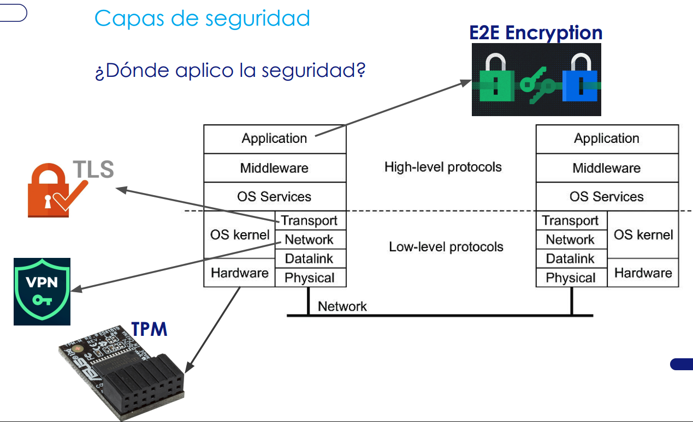

- **TPM**: Trusted Platform Module. Es un chip que es resistente a modificaciones, alberga algoritmos de encripción, guardado seguro de claves. Te da seguridad a nivel **hardware**
- **VPN**: seguridad en **capa de red**.
- **TLS**: seguridad en **capa de transporte**. HTTPS lo usa por debajo.
- **E2E Encryption**: seguridad a nivel **capa de aplicación**. Ej: Whatsapp, Telegram, etc.

Todos estos métodos de seguridad en cada capa solamente aplican seguridad, justamente, desde su capa para abajo.
- El TPM no puede afectar de ninguna manera lo que haga la VPN.

## Criptografía
### Posibles ataques - ¿Por qué encriptar?

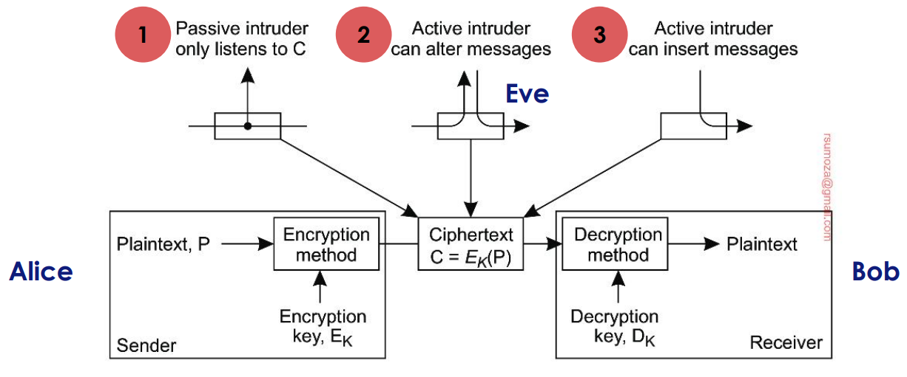

### Simétrica y Asimétrica
- **Simétrica**: uso la misma clave para encriptar y desencriptar
- **Asimétrica**: se usan claves diferentes pero ambas forman un par único (clave pública y privada)
  - Encriptar con este tipo de claves es más costoso, es menos performante
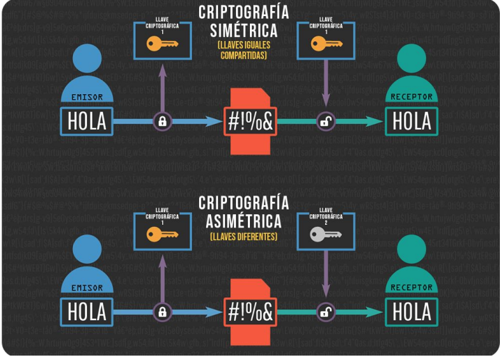

#### Casos de uso
- **Simétrica**
  - Cifrado
  - Claves de sesión
    - Clave de sesión: clave simétrica generada para cifrar la comunicación entre dos partes durante una sesión específica
- **Asimétrica**
  - Demostrar autoría de un documento
  - Establecer un canal seguro entre 2 partes (HTTPS)

### Hashing
Se recibe un mensaje `m`  de largo arbitrario y produce un string `h` de tamaño fijo.\
Permite detectar modificaciones de manera simple.
- **Función one-way**: computacionalmente inviable encontrar la entrada original de un mensaje `m` a partir de un hash `h`
- **Resistencia a colisiones débiles**: dado un mensaje de entrada `m` y su hash `h` = `H(m)`, es computacionalmente inviable encontrar otra entrada diferente `m'`, donde $m \neq m' \colon H(m) = H(m')$.
- **Resistencia a colisiones fuertes**: Esta propiedad es más estricta. Significa que, dada solo la función hash H, es computacionalmente inviable encontrar 2 valores de entrada diferentes cualesquiera `m` y `m'`, donde $m \neq m' \colon H(m) = H(m')$.

_Computacionalmente inviable_ refiere únicamente a la actualidad; se puede dar el caso que las computadoras cuánticas o de mayor procesamiento puedan vulnerar un hash.

**Casos de uso del hashing**:
- Firma digital
- Guardado de passwords
- Asegurarse que un descargable no fue modificado
- Dificultad de minado en algoritmos PoW
  - `PoW = Proof of Work`

El chiste del hashing es que te permite identificar fácilmente si un dato/archivo fue modificado.

### Firma digital
Es ponerle una marca a un dato con una cierta clave. Es lo que se usa en criptografía asimétrica

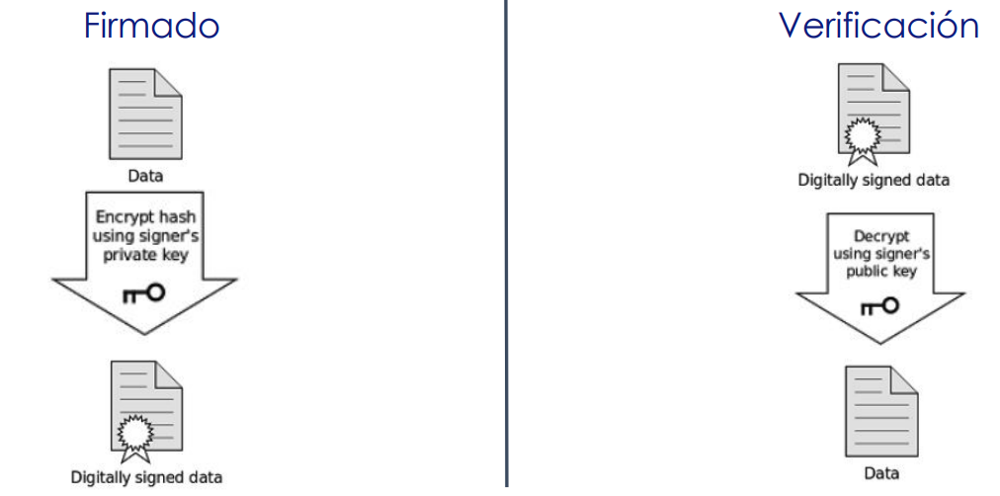

¿Qué limitaciones tiene?
- Poder de cómputo y tiempo. Es muy costoso firmar con criptografía asimétrica.

La solución a esta limitante es la siguiente:

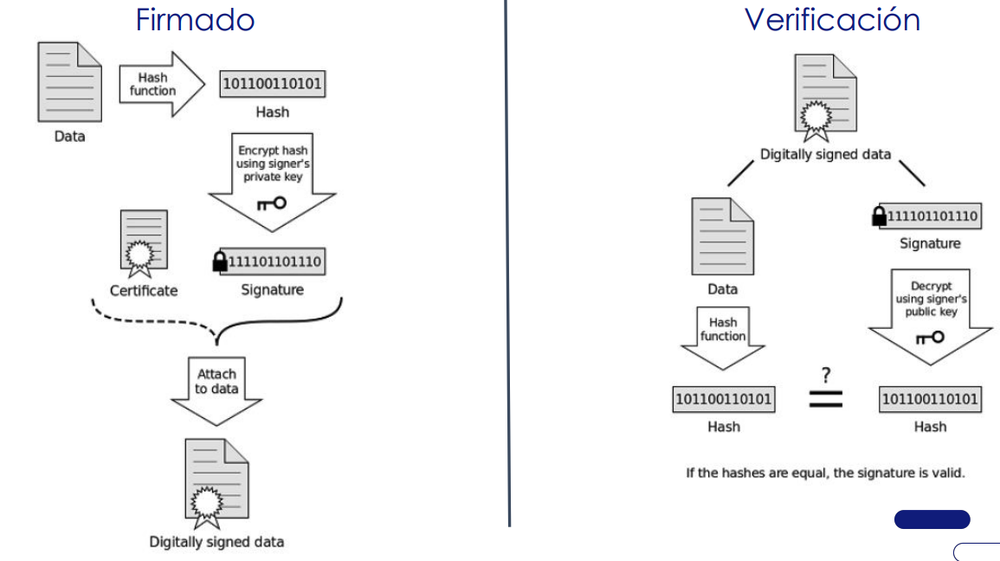

- Generar un hash del dato
- Encriptar el hash (siendo esto la **firma**)
- Adjuntarlo al certificado

Listo, tengo datos firmados

Del otro lado, voy a poder verificarlo solamente comparando los hashes

## Autenticación
### Métodos de autenticación
Buscamos:
- Validar la identidad que una persona, software o, en genérico, cliente/entidad dice tener. Asegurarse que estamos tratando con el usuario real
- Hoy no basta con solo un factor de autenticación sino que necesitamos múltiples capas

  

#### Autenticación basada en lo que un cliente...
- **Conoce**: contraseña o un número de identificación del cliente
- **Tiene**: tarjeta, token, teléfono
- **Es**: biometría como reconocimiento facial o huella dactilar
  - Tiene que ser necesariamente físico
- **Hace**: biometría dinámica como un patrón de voz o de tipeo

**Autenticación continua**: no solo se pide validación al ingresar sino dentro de la sesión ante operaciones sensibles

### Protocolos
- **Autenticación e integridad** deben ir juntos
  - No le siore de nada a Bob saber que un mensaje vino de Alice si no se puede asegurar que no fue modificado
- Protocolos de autenticación:
  - **Challenge Response (desafío)**
  - **Key Distribution Center**
  - **Public-key Cryptography**
- Luego de la autenticación se usan **Session Keys**
  - Se usan solo durante el tiempo de vida del canal. Al término se destruye
  - Permite preservar las lcaves de mayor vida como las que se usan para autenticar. Un atacante con suficiente información encriptada podría deducirla

#### Challenge-Response (Desafío)
- Se asume que Alice y Bob tienen una clave compartida (simétrica)
- Este método es importante cuando no te podés asegurar de que el canal es confiable/seguro.
- En el caso ideal se asume que nadie puede meterse en el medio ni puede hacerse pasar por una de las 2 partes del canal

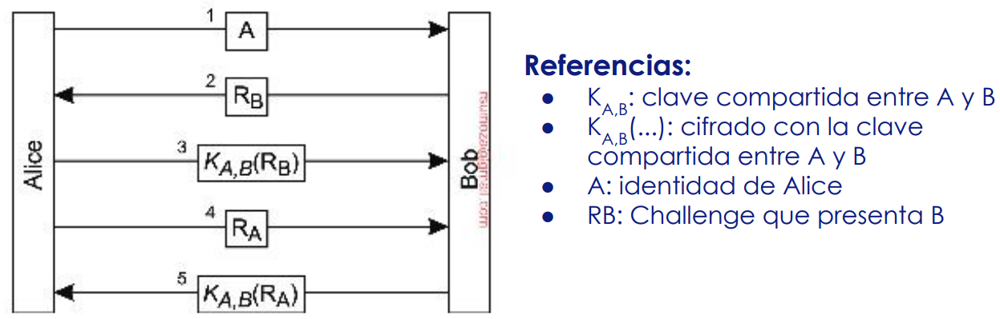

- Hola Bob soy Alice, quiero hablar con vos de manera autenticada
- Hola "Alice", te voy a mandar un Challenge para verificar que realmente sos Alice
  - Este challenge puede ser una palabra
- Alice firma el `challenge` con la clave compartida que tiene con Bob
- Bob compara la firma y se asegura que realmente es Alice, y le manda un OK
- Alice le dice ahora a Bob que le va a mandar un Challenge para lo mismo.
- Ya sabemos cómo termina.

##### En una versión simplificada (3 pasos):
- Alice le manda a Bob un mensaje diciendo que es ella y su challenge
- Bob le manda el challenge de ella firmado y un nuevo challenge para que ella firme
- Alice le manda el challenge que recibió ya firmado

¿Qué problemas trae? $\therefore$ Es muy propenso a ataques de Man In The Middle.

Si el atacante se pone a escuchar el canal de comunicación, puede deducir fácilmente la firma
[Insertar el ejemplo de Chuck]

#### Key Distribution Center
- Si tenemos muchos hosts se tienen que almacenar muchísimas claves compartidas. Se usa un **Trusted Party que genera Session Keys**.
- Se hace uso de un **ticket**, que es un mensaje de cifrado de naturaleza temporal
  - En principio la otra parte que recibe la Session Key no va a saber comprenderlo, puesto que está cifrado
- Existe un protocolo más avanzado basado en este: **Needham-Schroeder**
  - SSO también se basa en este protocolo

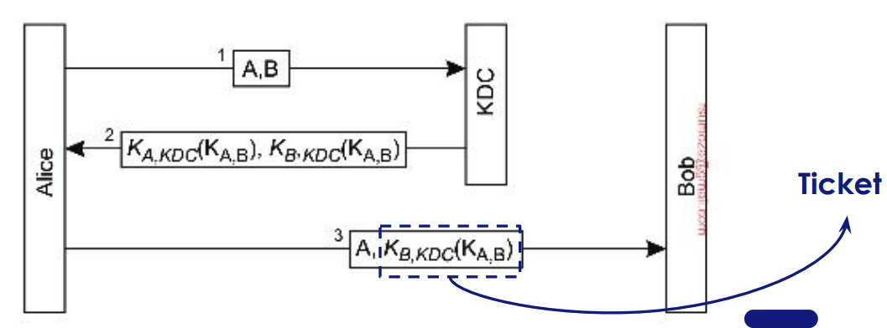

La diferencia principal con el protocolo anterior es que hay una sola clave compartida, con el KDC.

En resumen, el KDC es una parte confiable, y sus tickets sirven como garantía. Un host obtiene un ticket para comunicarse con otro servicio y puede hablarle al mismo sin problema, ya que dicho servicio puede validar con el ticket que el host emisor es legítimo. 

El KDC presenta un SPoF, todos confían en este. Si lo hackean, cagaron todos.

#### Criptografía de clave pública
- Se asume de antemano que ambas partes conocen la clave pública del otro (ambos usando pares de claves asimétricas)
- Alice envía su identidad y challenge firmado con la clave pública de Bob
- Importante tener garantía que Alice tiene la clave pública de Bob y no de alguien que se hizo pasar por él

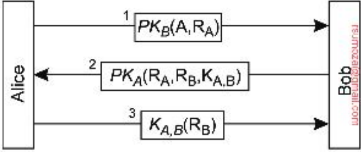

La diferencia respecto al Challenge-Response es que no tienen que firmar con una clave compartida, sino que firman con la clave pública y se van a asegurar de que sólo lo pueda leer quien tenga la clave privada.

La falencia de este protocolo es que por ahí la clave pública que tiene Alice no es necesariamente la de Bob, sino que puede ser la de otra persona que lo impersonó, justamente

### Desafíos que enfrentan los protocolos
1. Garantizar la integridad del mensaje y la autenticación mutua
2. Suplantación de identidad
3. Ataques de replicación
4. Gestionar eficientemente las claves secretas compartidas en sistemas grandes
   1. Distribución de claves, basicamente
   2. Las claves **se tienen que rotar** de alguna manera.
      1. Si pierdo la clave privada, tengo que notificarlo a quienes tengan mi clave pública
5. Autenticidad de las claves públicas
6. No revelar información sensible antes de la autenticación de las partes

## Autorización
**Definición**: Conceder acceso a los recursos del sistema una vez autenticada una entidad

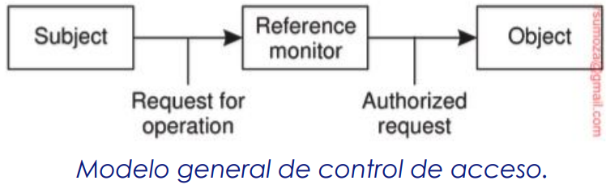

**Reference monitor**
- **Almacena** quién puede hacer qué
- **Decide** cuándo un sujeto puede hacer una operación

### Enfoques de protección
3 enfoques principales:
- Proteger **la información o el dato**, en su integridad
- Proteger las **operaciones a realizar**
- Proteger **quién tiene acceso a la información**

### Políticas de control de acceso
> Aclaración: AC = Access Control o Control de acceso
- **MAC - Mandatory AC**: la administracion central define políticas de acceso (ej: niveles de secreto, desde público a top secret)
- **DAC - Discretionary AC**: el propietario de un objeto decide quién tiene acceso (ej: permisos de archivos Unix, archivos de Google Drive)
- **RBAC - Role Based**: la autorización se basa en el rol del usuario en la organización (ej: profesor, estudiante)
- **ABAC - Attribute Based**: control de acceso más granular, basado en atributos de usuarios, objetos, entorno, conexión y administrativos (ej: Si tenes un DNI muy viejo/nuevo no podés hacer tal cosa)

### Delegación
- ¿Cómo delegar derechos de acceso sin compartir las credenciales principales?
- ¿Cómo hacerlo sin tener que estar consultando al usuario que delegó todo el tiempo?

**Respuesta: Proxy**
- Un proxy permite a su poseedor operar con derechos y privilegios iguales o restringidos en comparción con el sujeto que lo concedió
- Incluso le puede permitir delegar a su vez alguno o todos los derechos a otro usuario

El proxy puede impersonar (sin ser un ataque) a otro usuario/persona/entidad.

#### Estructura Proxy
1. **Certificado**
  a. $R$: conjunto de derechos de acceso delegados.
  b. $PK_proxy$ : es la parte pública de un secreto utilizada para autenticar al poseedor.
  c. El certificado está firmado por el emisor A para protegerlo contra modificaciones.
2. **Clave Secreta**: parte secreta que debe protegerse de la
divulgación

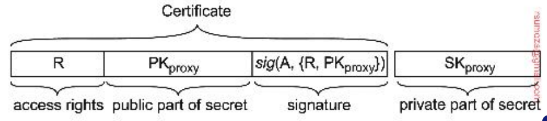

#### Proceso
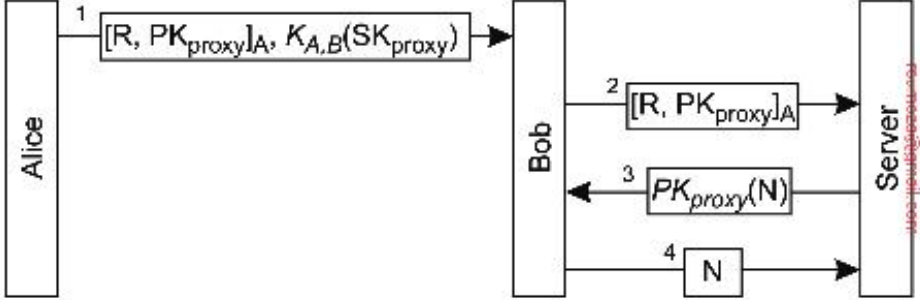
1. Alice le da a Bob la lista de derechos firmada junto con la parte pública del secreto. También le da la secret key cifrada.
2. Bob ejerce sus derechos, entrega lista firmada.
3. Se le pide la respuesta a un nonce $N$ firmado con la pub key.
4. Si Bob la proporciona, el Server sabrá que los derechos listados fueron delegados a Bob por Alice.

#### OAuth
- Es un protocolo de delegación usado por grandes empresas (Amazon, , Facebook, Microsoft, Twitter) y por muchos otros servicios.
- Su objetivo es permitir que una aplicación (por ejemplo, un cliente de correo o una app móvil) pueda acceder a recursos de un usuario (como tus correos, fotos o contactos) en otro servicio, sin que la app reciba directamente la contraseña del usuario.
- A diferencia de otros sistemas de delegación tipo proxy, en OAuth el usuario otorga permisos de manera granular (por ejemplo, "dejo que esta app vea mis contactos, pero no mis fotos"), y el acceso suele estar acotado por tiempo.
- OAuth separa claramente la autenticación (saber quién sos) de la autorización (qué puede hacer esa app en tu nombre), y usa *tokens de acceso* en vez de claves secretas largas o certificados que la aplicación debería proteger todo el tiempo.
- Esto reduce el riesgo en caso de compromiso y facilita revocar permisos específicos a aplicaciones sin afectar el acceso general del usuario.

## Confianza
Muchas de las decisiones las realizamos basadas en la confianza.
- Robos de cuentas de Whatsapp para pedir transferencias.
- Compras Crypto que se apalancan en la opinión de algún personaje conocido.
- Videos o imágenes fakes para hacer campañas de desinformación. 

En los sistemas hay muchas decisiones que se realizan de manera (semi)automatizados.
- ¿Cómo afecta eso a nuestras vidas?
- ¿Podemos confiar en esas decisiones?

**Definición**: La confianza es la certeza que una entidad tiene de qué otra se comportará
de acuerdo con una expectativa específica.

- **Complemento a la Autenticación**: Si bien la autenticación verifica una identidad, la pregunta clave es: ¿cuánto vale esa autenticación si no se puede confiar en la persona?
- **Limitación de Daños**: una autorización adecuada es vital, ya que puede usarse para limitar cualquier daño.
- **Dependencia y Expectativas**: Si las expectativas se hacen lo suficientemente explícitas (es decir, especificadas), es posible que ya no sea necesario depender de la confianza.
  - Ej: entre los microservicios de un sistema cerrado no hace falta estar autenticando a cada momento.

### Ataques Bizantinos
- Volviendo a procesos resilientes si queremos soportar ataques bizantinos debemos construir un sistema donde no haya confianza.
- Esto se logra especificando algoritmos de consenso que no dependen de un individuo sino de un grupo.
- Para lograr k-tolerance a fallos bizantinos, se requiere un total de $3k + 1$ servidores.
  - Si quiero soportar 1 servidor dañino se requiere 4 servidores en total

### Confiar en una identidad
- **Enfoque**: Se centra en la relación entre una identidad lógica y una entidad física.
- **Problemática**: El problema fundamental es el ataque Sybil, donde un atacante presenta múltiples identidades lógicas para controlar una parte desproporcionada del sistema.
- **Posible solución**: Se requieren mecanismos de contabilidad y prueba de coste que hagan que la clonación de identidades no sea rentable, como (Proof of Work, PoW) o (Proof of Stake, PoS) en blockchains

### Confiar en un sistema
- **Enfoque**: Se centra en cómo una estructura de datos distribuida puede generar confianza sin depender de terceros.
- **Problemática**: La necesidad de asegurar la integridad de los datos y su inmutabilidad.
- **Posible solució**n: La confianza se deriva de la transparencia y la protección criptográfica. En blockchain se logra a través de la vinculación mediante hashes de los bloques. Asegura que cualquier cambio en un bloque se propague y sea detectable en toda la cadena.

### En resumen...
**Confiar en una Identidad**:
- ¿La identidad que interactúa es legítima y única?
- Especialmente relevante en sistemas descentralizados donde la reputación es crucial para la toma de decisiones.
**Confiar en un Sistema**:
- Garantía técnica de que la información almacenada en el sistema es correcta y no ha sido manipulada.

## Monitoreo y auditoría
### Introducción
- **Objetivo**: garantizar que las políticas de seguridad se cumplen.
- **Auditoría**: herramienta pasiva para saber qué fue lo que sucedió. Pero no ayuda a prevenir.
- **Para eso existe**: Intrusion detection, busca detectar actividades no autorizadas.

### Herramientas - Firewall
- Filtro de tráfico.
- Puerta de entrada o salida hacia el mundo exterior.
- Decide qué tráfico es permitido o descartado.
- Categorías:
  - **packet-filtering**: funciona como router y decide según el contenido de los headers del paquete.
  - **application-level**: decide según el contenido del mensaje. Ejemplos: mail gateway o proxy gateway.

### Herramientas - Intrusion Detection Systems (IDS)
- **SIDS - Signature-based Intrusion Detection Systems**
  - Funcionan comparando patrones de intrusiones ya conocidas a nivel de red.
  - _Limitación_: resultan menos útiles ante ataques nuevos o desconocidos
- **AIDS - Anomaly-based Intrusion Detection Systems**
  - Se basa en la premisa que se puede modelar un comportamiento típico del sistema para luego detectar cualquier comportamiento anómalo.
  - Se basa especialmente en herramientas de IA como Machine Learning.
  - _Desafío_: disminuir los falsos-positivos (etiquetado incorrecto como intrusión) manteniendo un número bajo de falsos-negativos (intrusiones omitidas).
