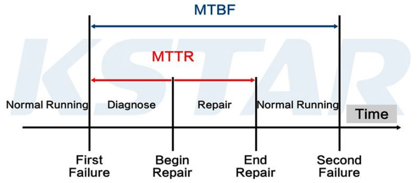
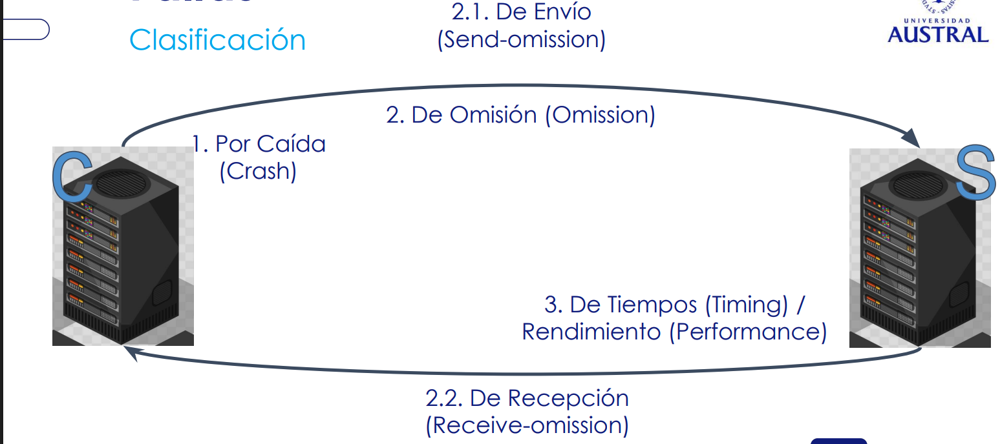
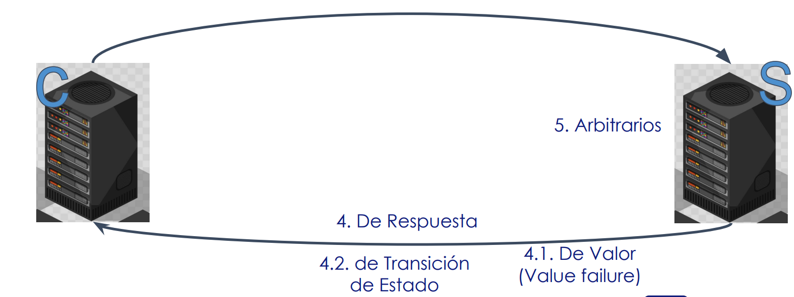
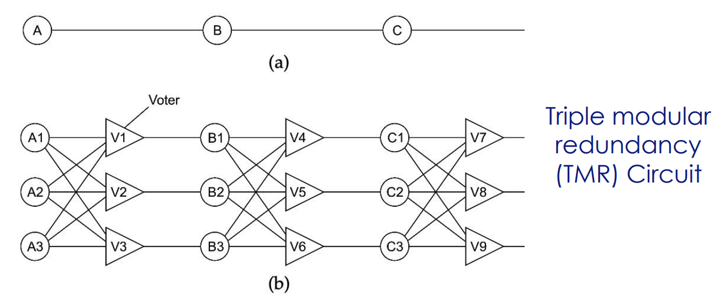
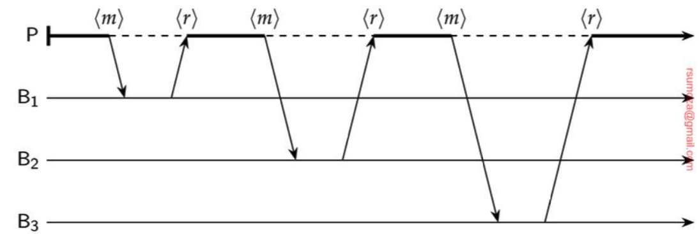

# Tolerancia a fallos
Se espera que el sistema tenga fallas: es inevitable. Lo que se busca es que sea tolerable a las mismas.

## Confiabilidad y sus requerimientos
### Dependable Systems

High availability + Reliability =  Dependability 

Tolerancia a fallas:
* Tolerar fallas parciales
* Tener la capacidad de auto recuperarse

(Ver definiciones de clases anteriores de distintos conceptos relacionados a disponibilidad)

El concepto de "Dependability", yendo al ejemplo de un auto, se pone en juego en caso de que, si bien el motor puede andar bien y tener buena potencia, la batería quizá falle todo el tiempo.

### Métricas

* Mean Time To Failure (MTTF): Tiempo medio hasta el fallo
	* EJ: en un datacenter, se mide cuál es el tiempo promedio hasta la falla de un disco, para poder reemplazarlo antes.
* Mean Time To Repair (MTTR): Tiempo medio para reparar.
* Mean Time Between Failures (MTBF): MTTF + MTTR
* Disponibilidad (A): MTTF / (MTTF + MTTR)

#### Métricas - ejercicio

Availability en 1 mes = 99,95% uptime

¿Cuántos minutos en el mes puede estar caído el sistema? Es decir, que no responde o responde con 500s (Internal Server Error).

¿Cuántos minutos hay en 30 días? 43.200 minutos

Respuesta:
* Tiempo disponible = 43.200 * 99.95% = 43.178,4 minutos
* Tiempo indisponible = 43.200 - 43.178,4 = 43.200 * (1 - 99.95%)
* Tiempo indisponible = 21,6 minutos

¿Es mucho o poco tiempo? **Depende**. Si es algo crítico, sí  (p. ej. el funcionamiento de respiradores en un hospital). En caso de que no, quizá no sea tan grave.

Es muy común que empresas serias muestren su uptime en una página web (p. ej. Mercado Libre).

## Teorema de CAP

Un sistema distribuido solo puede garantizar simultáneamente dos de las siguientes tres propiedades:

1. C - **Consistencia** (Consistency): Todos los nodos del sistema ven la misma versión de los datos al mismo tiempo. Es como si hubiera una única copia actualizada de los datos
2. A - **Disponibilidad** (Availability): Todas las solicitudes reciben una respuesta (no un error), aunque esa respuesta no siempre contenga la versión más reciente de los datos
3. P - **Tolerancia a Particiones** (Partition Tolerance): El sistema continúa funcionando incluso si algunos nodos no pueden comunicarse entre sí (una "partición" de la red).

### Consistencia, disponibilidad y particionamiento

* Sistemas **CP**: Priorizan la Consistencia. Si hay una partición, el sistema puede volverse no disponible para garantiszar que las respuestas sean correctas.
	* EJ: sistema bancario, donde es preferible tardar en mostrarle al usuario su balance correcto, antes de mostrarle uno desactualizado y que haga una transacción incorrecta.
* Sistemas **AP**: Priorizan la Disponibilidad. Si hay una partición, el sistema puede devolver datos potencialmente inconsistentes para seguir respondiendo.
	* EJ: un Marketplace como Mercado Libre, donde yo quizá hago una compra de algo que en realidad no tiene stock. Sin embargo, después puede arreglarse con una compensación (EJ: un vale de compra por $\$5000$)

## Fallas

¿Qué es una falla?

* Un sistema **falla (failure)** cuando no cumple sus promesas o especificaciones.
	* Es lo más abstracto, porque puede no ser causada por un error del sistema en sí. La falla es un comportamiento que yo no esperaba del sistema.
	* De la falla no te salvás (?)
* Un **error** es una parte del estado del sistema que puede llevar a un fallo (p. ej. un bug de programación)
* Un **defecto (fault)** es la causa de un error (p. ej. un programador que introduce un bug, un disco rallado, etc.)

La cadena de sucesos es: Defecto -> Error -> Falla.

Es imporatnte distinguirlos porque es la forma en la cual uno puede hacerse tolerante a cada uno de estos 3 problemas.
### Categorización de fallas

1. **Fallas por caída (Crash Failures)**: se detiene y no responde
2. **Fallos de Omisión (Omission failures**)
	1. Fallos de envío (Send-omission): falla al enviar un mensaje que debía enviar
	2. Fallos de recepción (Receive-omission): falla al recibir mensajes que llegan
		1. Cuando tengo una sobrecarga a nivel de OS (porque tengo demasiados threads laburando), se me puede producir un fallo de este tipo, ya que no tengo capacidad suficiente para recibir.
3. **Fallos de tiempo (Timing failures)**: timeout. Se tarda mucho en responder un mensaje.
	1. La diferencia entre omisión y timing es que en el caso del primero falla instantáneamente.
4. **Fallos de respuesta**: respuesta es incorrecta
	1. Fallos de valor (Value Failure): La respuesta contiene un valor incorrecto. Yo quería un determinado valor, y me responden cualquier cosa
	2. Fallos de transición de estado: se desvía el correcto flujo de control
5. **Fallos arbitrarios**: puede producir respuestas incorrectas en momentos arbitrarios (ej: respuestas inconsistentes). Este tipo de error es el peor, porque como los errores no siguen un patrón, son difíciles de detectar. Siendo rigurosos, no existen los fallos arbitrarios, porque siempre hay una causa. Lo que realmente pasa es que yo como desarrollador desconozco la causa.
	1. Falla por omisión: Un componente no realiza una acción que debería hacer
	2. Falla por comisión: Un componente realiza una acción que no debería haber realizado.

> Fun fact 🤓: Los fallos arbitrarios también se llaman _bizantinos_

### Detección de fallas

De suma importancia para la tolerancia a fallos.
* **Dificultad en sistemas asíncronos**: en un sistema puramente asíncrono, es imposible distinguir si un proceso se ha caído o si solo está respondiendo muy lento.
	* Algo que se suele hacer es medir el "heartbeat": el load balancer envía requests cada cierto tiempo para verificar si el servicio está vivo. Cuando no respondió ante X intentos, se considera muerto. 
* Mecanismos comunes: la práctica se basa en mecanismos de tiempo de espera (timeouts) para sospechar que un proceso ha fallado.
#### Forma de detección

En los casos siguientes, la severidad es ascendente.

Imaginemos que un proceso `P` intenta detectar si un proceso `Q` ha fallado:

1. **Fallas fail-stop**: pueden detectarse de forma confiable, asumiendo correcta comunicación y un retraso máximo en las respuestas de `Q`.
2. **Fallas fail-noisy**: `P` solo eventualmente llega a la conclusión correcta de que `Q` ha fallado. Puede haber un tiempo desconocido durante el cual las detecciones de `P` sobre el comportamiento de `Q` no son fiables
3. **Fallas fail-silent**: Se asume que los enlaces de comunicación no tienen fallas, pero el proceso `P` no puede distinguir entre fallas por caída y fallas por omisión (no sabe si está caído o si por algún motivo no está respondiendo)
4. **Fallas fail-safe**: fallas arbitrarias de `Q`, pero son benignas: no pueden causar ningún daño.
5. **Fallas fail-arbitrary**: las fallas de `Q` pueden ser inobservables además de ser perjudiciales para el comportamiento correcto de otros procesos.

## Masking (manejo de fallos) mediante redundancia

1. **Redundancia de información**: Se añade información redundante (p. ej. códigos de detección o corrección de errores, como en TCP)
2. **Redundancia de tiempo**: Se realiza una acción varias veces (p. ej. retransmisión de mensajes).
3. **Redundancia física**: Se usan componentes duplicados (p. ej. replicación de procesos o datos).

## Redundancia

Redundancia no es lo mismo que replicación:
* **Redundante**: se usa al mismo tiempo que algo
* **Replicado**: es una copia de algo

¿Qué pasa cuando le pido lo mismo a X sistemas distintos? Espero que respondan lo mismo. **Ese es el principal problema de la redundancia**, porque quiero ser consistente con mis respuestas.

- Siguiendo el caso de la imagen, incluso el votador se replica, porque es capaz de caerse también.

Evidentemente la redundancia tiene un costo

### Y en Software?

* **Server redundancy**: Múltiples instancias
* **Data Redundancy**: Múltiples copias de la DB
* **Network Redundancy**: Múltiples redes por si una se cae
* Otros...

Ejemplo: un servidor por país
- Puedo tener más disponibilidad porque distribuye la carga
- Pero no tengo redundancia. Se cae el servidor de un país y ese país queda sin servicio

## Recuperación ante fallos

Tiene más relación con una pérdida de datos que con una caída de la aplicación. Consiste en cómo se vuelve a un estado razonable después de haber tenido una pérdida de datos.

### Recuperación del sistema

Objetivo:
* Analizar las dependencias entre servicios para entender cómo reaccionar ante un evento de recuperación de uno de los miembros.
* **Dependencia de datos entre aplicaciones**

El problema principal de la recuperación ante fallas es la **consistencia entre los nodos del sistema**. Por ejemplo, si un servicio de ventas depende de ciertos datos consistentes que tiene un servicio de historial, al caerse este último, el primer servicio no puede realizar operaciones consistentes.

### Recuperación

* La recuperación se refiere al proceso de devolver un componente fallido (o todo el sistema) a un estado correcto luego de que un fallo haya ocurrido, y haya sido detectado/reparado
* Lo que se tiene como **objetivo** es minimizar el impacto y restaurar el servicio
* Tenemos distintos tipos de recuperación:
  * Hacia atrás (backwards): volver a un estado anterior correcto
  * Hacia adelante (forward): es necesario conocer los errores que van a ocurrir con antelación
    * Es un quilombo de implementar porque tampoco podés pretender "atajar todos los penales" 
#### Backwards Recovery - Checkpoint
* El sistema debe guardar su estado periódicamente: **checkpoint**
* En caso de fallo, un proceso puede retroceder a su último checkpoint válido en lugar de reiniciar desde cero
* La recuperación requiere construir un **estado global consistente** a partir de los estados locales guardados por cada proceso
* Tenemos 2 maneras principales de tomar checkpoints:
  * **De manera coordinada**: usando un algoritmo como 2PC. Es más simple que tenga un estado global consistente
  * **De manera independiente**: el desafío justamente yace en lograr un estado global consistente
* La línea de recuperación (**recovery line**) es la colección más reciente de puntos de control que forman un estado global consistente.
* Es recomendable volver el estado a una línea de recuperación.
* Es más simple el checkpoint coordinado y por lo tanto más usado.

##### Desafíos del checkpoint independiente
- Cada proceso graba su estado local ocasionalmente y de manera no coordinada.
- Para descubrir una línea de recuperación, cada proceso debe retroceder a su estado guardado más reciente.
- Si estos estados locales conjuntamente no forman un estado global consistente requiere que otro proceso retroceda a un estado anterior.
- Esto puede desencadenar un efecto **dominó**.

### Message Logging
El checkpointing tradicional tiene un par de limitiaciones:
- **Costo Elevado**: La toma de checkpoints es una operación costosa y puede penalizar severamente el rendimiento.
- **No Determinismo**: Si solo se usa checkpointing, el comportamiento después de la recuperación puede ser diferente al original debido a que pueden recibirse los mensajes en orden o tiempos diferentes de los que se había recibido antes de la falla

Para "parchear" esas fallas que tiene el checkpoint, surge el `Message Logging`.
#### ¿Qué es?
* **Idea clave**: Si la transmisión de mensajes puede ser "reproducida" (replayed), se puede restaurar un estado consistente global.
* **Mecanismo**: 
	* Se parte de un estado previamente checkpointed
	* Todos los mensajes enviados desde ese checkpoint se retransmiten y manejan o ejecutan de nuevo
* Beneficios: 
	* Permite restaurar un estado más allá del checkpoint más reciente sin el alto costo de nuevos checkpoints
	* Facilita una reproducción exacta de los eventos
	* Mayor eficiencia en la práctica, al requerir menos checkpoints.

## Resiliencia de Procesos

- **Foco**: ¿Cómo hacer que un proceso o un conjunto de procesos sea tolerante a fallos?
- **Objetivo**: hacer que un grupo de procesos se comporte como un único proceso más robusto.
- **Metodología**: se logra mediante la replicación de procesos
- **Desafío**: mantener la coherencia y coordinación entre los procesos replicados para que actúen como una sola entidad fiable.

### Organización de grupos

Dos opciones:
1. Todos los procesos son iguales, decisiones colectivas (ej: muchos sistemas P2P)
2. Un coordinador (líder) y trabajadores (p. ej. DNS, primary-backup).

Gestión de membresía:
* Crear/eliminar grupos, unir/dejar procesos. Centralizado (servidor de grupo) vs Descentralizado

### Algoritmos de consenso

En definitiva, tengo varios procesos redundantes, y necesito una sola respuesta.
* **Supuesto**: en un sistema tolerante a fallos, todos los procesos ejecutan los mismos comandos, en el mismo orden, de igual manera que todo el resto de los procesos sin errores.
* **Problema**: ¿Cómo conseguir consenso sobre el comando concreto a ejecutar?
* **Enfoques**: el algoritmo de consenso elegido depende del modelo de fallo que el sistema debe tolerar
#### K-Fault Tolerant
Un sistema es **_k-fault tolerant_** si puede sobrevivir a fallos en k componentes y seguir cumpliendo sus especificaciones
- fail-silent: $k+1$ componentes
- fail-safe: un mínimo de $2k+1$ procesos

Si un sistema k-fault tolerant sufre la caída de más de $k$ miembros, no se puede confiar en sus resultados

> En unga-unga, si yo te digo "flaquito, fijate que tengo 10 componentes en mi arquitectura y sigo andando si se me caen 5". En la que se me cayeron 6, es imposible confiar en los resultados de mi sistema.

### Fallos por caída

| **Protocolo/Enfoque**           | **Fallos tolerados**                                                                                      | **Requisitos mínimos**                                          |
| ------------------------------- | --------------------------------------------------------------------------------------------------------- | --------------------------------------------------------------- |
| Basado en inundación (Flooding) | Fail-stop(detectables de forma fiable)                                                                    | -                                                               |
| Raft                            | Fail-noisy (la caída es detectada correctamente en algún momento)                                         | -                                                               |
| Paxos                           | Fallos por caída (crash failures). También asume comunicación no fiable y sistemas parcialmente síncronos | $2k + 1$ servidores para tolerar $k$ fallos de caída silenciosa |

### Fallos arbitrarios
Estos son los fallos más graves, donde un servidor puede actuar de manera inconsistente o maliciosa, produciendo resultados incorrectos que no pueden detectarse inmediatamente.

| **Protocolo/Enfoque**                          | **Fallos tolerados**                          | **Requisitos mínimos**                               |
| ---------------------------------------------- | --------------------------------------------- | ---------------------------------------------------- |
| Tolerancia Práctica a Fallos Bizantinos (PBFT) | Fallos Arbitrarios (Bizantinos).              | $3k + 1$ procesos para tolerar k fallos arbitrarios. |
| HotStuff                                       | Fallos Arbitrarios (como una mejora de PBFT). | $3k + 1$ procesos                                    |

### Consenso en sistemas de Blockchain

| Tipo de blockchain | Enfoque de consenso                                                                     | Contexto                                                                                  |
| ------------------ | --------------------------------------------------------------------------------------- | ----------------------------------------------------------------------------------------- |
| Sin permiso        | Basado en elección de líder (p. ej. Prueba de Trabajo PoW, Prueba de Participación PoS) | El líder decide qué bloque se añade                                                       |
| Con permiso        | PBFT o variantes más escalables (p. ej. HotStuff)                                       | Usado por grupos pequeños de procesos tolerantes a fallos que deciden quién añade bloques |
### Limitaciones

- **Rendimiento**: replicación y organización de procesos implican una pérdida potencial de rendimiento debido a la gran cantidad de mensajes que deben intercambiarse para alcanzar el consenso.
- **Procesos asíncrono**: es imposible alcanzar el consenso en un sistema asíncrono si existe incluso un único proceso defectuoso (no podemos diferenciar si está caído o está lento)
- **Teorema CAP**: en los sistemas distribuidos se espera que hayan particiones, lo que obliga a elegir entre `C` o `A`

## Comunicación cliente-servidor confiable

Antes hablamos de errores en los procesos. ¿Qué pasa si fallan los canales de comunicación?

- Nos interesa poder manejar los errores.
- Asegurar que los mensajes se procesen una sola vez o al menos de manera predecible.

Examinemos las 2 categorías: Point To Point y RPC
1. Point to Point (conexión dedicada)
	1. Confiabilidad basada en el protocolo de comunicación TCP
	2. Ante un fallo se puede intentar establecer conexión
2. RPC
   1. **Objetivo**: hacer parecer que estamos haciendo llamadas locales

### Posibles errores - RPC

1. No se puede conectar con el servidor
2. Se pierde el mensaje enviado por el cliente
3. El servidor muere luego de recibir el mensaje
4. El mensaje de respuesta del servidor se pierde
5. El cliente muere luego de enviar el mensaje

### Posibles soluciones - RPC

1. Handlear una excepción. Pero se tendría la ilusión de estar usando un servidor local
2. Configurar un timeout en el cliente con algún retry.
3. Timeout con entry, ¿pero cómo asegurás que no haya un reproceso?
	1. At least once
	2. At most once
	3. No guarantees
4. Timeout con retry
	1. Retransmisión
	2. Operaciones idempotentes. No siempre se puede (ver saldo vs transferir plata)
	3. Número de secuencia en los mensajes. Requiere mantener estado
	4. Bit de retransmisión agregado a la solicitud
5. Existen algunas propuestas complejas y con limitaciones. Se recomienda no hacer nada y que, luego del reinicio, se pueda volver a un estado anterior a su reinicio (ver [Recuperación](#recuperación)).

>Respecto a la idempotencia, refiere que al ejecutarse dos veces una solicitud, tenga el mismo efecto.
> - **La idempotencia** es una propiedad del mensaje, aplicada cuando es realmente importante (p. ej. en streaming, ya de base no me interesa volver a enviar un frame si falló)
> - El ejemplo más claro es una transferencia bancaria, donde tengo que asegurar que una transacción no se ejecute dos veces.
> - Como todo, la idempotencia tiene sus costos.

## Comunicación de grupo o multicast confiable

## Definición

* Servicio que permite enviar mensajes a múltiples receptores en un sistema distribuido
* Esencial para la tolerancia a fallos 

Tenemos como **objetivo principal** asegurar que los mensajes se entreguen a todos los miembros de un grupo particular

### ¿Cómo realizamos la comunicación?

Se realiza una conexión point to point para cada proceso. Puede parecer una solución, pero no realmente. Se queda corta en _escalabilidad_.

- Si enviamos múltiples solicitudes en paralelo, puede escalar

### Orden en los mensajes

* Un mensaje enviado a nu grupo debe ser entregado a cada miembro no defectuoso de ese grupo, o a ninguno de ellos si el remitente falla durante la transmisión. Eso se llama: **sincronía virtual**, establece "todo o nada".
* Pero no asegura el orden de entrega entre mensajes. Para ello se distinguen cuatro tipos principales de ordenamiento
	1. Multicasts no ordenados (Unordered multicasts)
	2. Multicasts ordenados FIFO
	3. Multicasts ordenados causalmente (Casually ordered)
	4. Entrega totalmente ordenada (Totally ordered): todos los mensajes son entregados en orden a todos los miembros del grupo, independientemente del origen o de su causalidad.

La sincronía virtual que ofrece una entrega totalmente ordenada se llama **Atomic Multicast**.

6 formas diferentes de comunicación de grupo (multicast) confiable o sincronía virtual

| Multicast     | ordenamiento | Entrega totalmente ordenada |
| ------------- | ------------ | --------------------------- |
| Confiable     | No           | No                          |
| FIFO          | FIFO         | No                          |
| Causal        | Causal       | No                          |
| Atomic        | No           | Sí                          |
| FIFO Atomic   | FIFO         | Sí                          |
| Causal Atomic | Causal       | Sí                          |

## Transacciones en servicios

Contexto
* Sistemas complejos con relaciones entre ellos
	* Muchas veces tiene que operar sincronizados
* Ejemplos:
	* Reservar hotel y vuelo
* ¿Cómo aseguro que se haga todo o nada?
	* Cada uno es una operación distinta

Dos operaciones en principio:
* Commit distribuido y atómico
	* Complicado hacerlo en ciertos casos distintos a una base de datos
	* EJ: algoritmo two-phase commit (2PC), pero en la práctica es un problema más que una solución
    	* Involucra 1 coordinar y $N$ participantes
* Compensaciones

### Compensaciones

Deshacer una operación ya realizada. Esto es una gestión para deshacer algo ya realizado. Consiste en "ir desarmando" lo que se fue haciendo. Es una consistencia de negocio donde se deshace lo que se hizo.

* No es un rollback, es decir, no hay un *undo* de la operación en sí.
* EJ de situación - Despegar.com: reservo el hotel, pero el pasaje ya lo saqué y está commiteado
* Esta opción es la más común en sistemas distribuidos.

Ejemplos de compensación:
* Envío un mail para avisar
* Hago un contramovimiento
